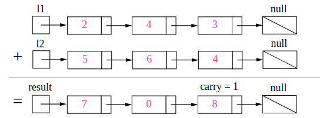

# LeetCode Part1

> 每天小刷几题，提神醒脑～

## 1. 两数之和

> 给定一个整数数组和一个目标值，找出数组中和为目标值的**两个**数。
>
> 你可以假设每个输入只对应一种答案，且同样的元素不能被重复利用。
>
> **示例:**
>
> ```
> 给定 nums = [2, 7, 11, 15], target = 9
> 
> 因为 nums[0] + nums[1] = 2 + 7 = 9
> 所以返回 [0, 1]
> ```

【解题思路】

> 相关话题：数组，哈希表

**方法1：暴力法**

遍历每个元素$x$，查找是否存在另一个数$target-x$。

时间复杂度$O(n^2)$    空间复杂度$O(1)$

**方法2：哈希表**

利用哈希表查找近似$O(1)$的特点，空间换时间；在进行迭代并将元素插入到表中的同时，我们还会回过头来检查表中是否已经存在当前元素所对应的目标元素。如果它存在，那我们已经找到了对应解，并立即将其返回。

时间复杂度：$O(n)$    空间复杂度：$O(n)$

【代码实现】

**方法1：暴力法**

```cpp
vector<int> twoSum(vector<int> &nums, int target) {
    int n = nums.size();
    for (int i = 0; i < n - 1; ++i) {
        for (int j = i + 1; j < n; ++j) {
            if (nums[i] + nums[j] == target)
                return {i, j};
        }
    }
    return {-1, -1};
}
```

**方法2：哈希表**

```cpp
vector<int> twoSum2(vector<int> &nums, int target) {
    unordered_map<int, int> table;
    int n = nums.size();
    for (int i = 0; i < n; ++i) {
        if (table.find(target - nums[i]) == table.end())
            table[nums[i]] = i;
        else
            return {table[target - nums[i]], i};
    }
    return {-1, -1};
}
```

## 2. 两数相加

> 给定两个**非空**链表来表示两个非负整数。位数按照**逆序**方式存储，它们的每个节点只存储单个数字。将两数相加返回一个新的链表。
>
> 你可以假设除了数字 0 之外，这两个数字都不会以零开头。
>
> **示例：**
>
> ```
> 输入：(2 -> 4 -> 3) + (5 -> 6 -> 4)
> 输出：7 -> 0 -> 8
> 原因：342 + 465 = 807
> ```

【解题思路】

> 相关话题：链表，数学

没什么特殊的技巧，就是按照加法准则进行即可。（但需注意的是：如果是直接在"输入链表中"直接修改则会相对麻烦一点---要处理选择的链表较短以及最后额外进1的情况）



【代码实现】

```cpp
ListNode *addTwoNumbers(ListNode *l1, ListNode *l2) {
    auto res = l1;
    int flag = 0;
    while (l1 || l2) {
        if (l1 && l2 && (l1->next == nullptr && l2->next)) {
            l1->next = l2->next;
            l2->next = nullptr;
        }
        if (l1 && l2) {
            auto val = l1->val + l2->val + flag;
            l1->val = val % 10;
            flag = val / 10;
            if (l1->next == nullptr && flag) {
                l1->next = new ListNode(0);
            }
            l1 = l1->next, l2 = l2->next;
        } else {
            auto val = l1->val + flag;
            l1->val = val % 10;
            flag = val / 10;
            if (l1->next == nullptr && flag) {
                l1->next = new ListNode(0);
            }
            l1 = l1->next;
        }

    }
    return res;
}
```

## 3. 无重复字符的最长子串

> 给定一个字符串，找出不含有重复字符的**最长子串**的长度。
>
> **示例 1:**
>
> ```
> 输入: "abcabcbb"
> 输出: 3 
> 解释: 无重复字符的最长子串是 "abc"，其长度为 3。
> ```
>
> **示例 2:**
>
> ```
> 输入: "bbbbb"
> 输出: 1
> 解释: 无重复字符的最长子串是 "b"，其长度为 1。
> ```
>
> **示例 3:**
>
> ```
> 输入: "pwwkew"
> 输出: 3
> 解释: 无重复字符的最长子串是 "wke"，其长度为 3。
>      请注意，答案必须是一个子串，"pwke" 是一个子序列 而不是子串。
> ```

【解题思路】

> 相关话题：哈希表，双指针，字符串

具体非常多种解法可以参考：[阅读解答](https://leetcode-cn.com/problems/longest-substring-without-repeating-characters/solution/)

滑动窗的思想：使用哈希表将字符存储在当前窗口 $[i, j)$（最初 $j = i$）中。 然后我们向右侧滑动索引$j$，如果它不在哈希表中，我们会继续滑动 $j$。直到 $s[j]$ 已经存在于哈希表中。此时，我们找到的没有重复字符的最长子字符串将会以索引 $i$ 开头。如果我们对所有的 $i$ 这样做，就可以得到答案。（合起来就一句话：始终保证窗口$[i,j)$内为不重复字母）

**下面的代码是上述思想的"改进"：主要为了更快的获得下一个起始位置$i$。（否则就要依次删除左边的对象来获得下一个起始位置）**

时间复杂度：$O(n)$， 空间复杂度：$O(min(m,n))$

【代码实现】

```cpp
int lengthOfLongestSubstring(string s) {
    int n = s.length(), cur = 0, res = 0;
    unordered_map<char, int> table;
    for (int i = 0; i < n; ++i) {
        if (table.find(s[i]) == table.end()) {
            table[s[i]] = i;
        } else {
            res = max(i - cur, res);
            cur = max(cur, table[s[i]] + 1);
            table[s[i]] = i;
        }
    }
    return max(res, n - cur);
}
```

## 4. 两个排序数组的中位数

> 给定两个大小为 m 和 n 的有序数组 **nums1** 和 **nums2** 。
>
> 请找出这两个有序数组的中位数。要求算法的时间复杂度为 $O(log (m+n))$ 。
>
> 你可以假设 **nums1** 和 **nums2** 不同时为空。
>
> **示例 1:**
>
> ```
> nums1 = [1, 3]
> nums2 = [2]
> 
> 中位数是 2.0
> ```
>
> **示例 2:**
>
> ```
> nums1 = [1, 2]
> nums2 = [3, 4]
> 
> 中位数是 (2 + 3)/2 = 2.5
> ```

【解题思路】

> 相关话题：数组，二分查找，分治算法
>
> 注：$O(m+n)$的方法倒是很简单

我们的"终极目标"是将两个数组拆分成下述情况：

```
          left_part          |        right_part
    A[0], A[1], ..., A[i-1]  |  A[i], A[i+1], ..., A[m-1]
    B[0], B[1], ..., B[j-1]  |  B[j], B[j+1], ..., B[n-1]
```

且满足：

1. `len(left_part)=len(right_part)`
2. `max(left_part)<=min(right_part)`

为了满足上述两个条件，我们只需要保证：（即寻找A的拆分方法中满足条件的情况）

1. `i+j=m-i+n-j`（或`m-i+n-j+1`）如果`n>=m`，只需要`i=0~m, j=(m+n+1)/2-i`
2. `B[j-1]<=A[i]`以及`A[i-1]<=B[j]`

> 在 $[0，m]$ 中搜索并找到目标对象 $i$，以使：
> $$
> B[j-1]\le A[i]\quad且A[i-1]\le B[j],其中j=\frac{m+n+1}{2}-i
> $$
>

【代码实现】

```cpp
double findMedianSortedArrays(vector<int> &nums1, vector<int> &nums2) {
    int m = nums1.size(), n = nums2.size();
    if (m > n) {   // 保证m<n
        nums1.swap(nums2);
        swap(m, n);
    }
    int imin = 0, imax = m, halflen = (m + n + 1) / 2;
    while (imin <= imax) {
        int i = (imax + imin) / 2;
        int j = halflen - i;
        if (i < imax && nums2[j - 1] > nums1[i])
            imin = i + 1;
        else if (i > imin && nums1[i - 1] > nums2[j])
            imax = i - 1;
        else {
            int maxleft = 0;
            if (i == 0) maxleft = nums2[j - 1];
            else if (j == 0) maxleft = nums1[i - 1];
            else maxleft = max(nums1[i - 1], nums2[j - 1]);
            if ((m + n) % 2 == 1) return maxleft;

            int minright = 0;
            if (i == m) minright = nums2[j];
            else if (j == n) minright = nums1[i];
            else minright = min(nums2[j], nums1[i]);

            return (maxleft + minright) / 2.0;
        }
    }
    return 0.0;
}
```

## 5. 最长回文子串

> 给定一个字符串 **s**，找到 **s** 中最长的回文子串。你可以假设 **s** 的最大长度为1000。
>
> **示例 1：**
>
> ```
> 输入: "babad"
> 输出: "bab"
> 注意: "aba"也是一个有效答案。
> ```
>
> **示例 2：**
>
> ```
> 输入: "cbbd"
> 输出: "bb"
> ```

【解题思路】

> 相关话题：字符串，动态规划

#### 方法一：暴力法

很明显，暴力法将选出所有子字符串可能的开始和结束位置，并检验它是不是回文。（即检查所有的区间---需要$O(n^2)$，然后验证每个区间是否为回文---需要$O(n)$）

时间复杂度：$O(n^3)$，  空间复杂度：$O(1)$

#### 方法二：动态规划

为了改进暴力法，我们首先观察如何避免在验证回文时进行不必要的重复计算。考虑 $ababa$ 这个示例。如果我们已经知道$bab$ 是回文，那么很明显，$ababa$ 一定是回文，因为它的左首字母和右尾字母是相同的。

所以定义$P(i, j)$如下：
$$
P(i,j)=\begin{cases}true,\quad 如果字符串S_i...S_j是回文子串\\ false,\quad 其他情况\end{cases}
$$
因此：
$$
P(i,j)=(P(i+1,j-1)\ and\ S_i==S_j)
$$
这产生了一个直观的动态规划解法，我们首先初始化一字母和二字母的回文，然后找到所有三字母回文，并依此类推…

时间复杂度：$O(n^2)$， 空间复杂度：$O(n^2)$

#### 方法三：中心扩展算法

回文中心的两侧互为镜像。因此，回文可以从它的中心展开

时间复杂度：$O(n^2)$， 空间复杂度：$O(1)$

【代码实现】

```cpp
string longestPalindrome(string s) {
    int n = s.length(), res = n > 0 ? 1 : 0;
    int res_left = 0;
    for (int i = 0; i < n; ++i) {
        int left = i - 1, right = i + 1;
        while (left >= 0 && s[left] == s[i])
            --left;
        while (right < n && s[right] == s[i])
            ++right;
        while (left >= 0 && right < n && s[left] == s[right]) {
            --left;
            ++right;
        }
        if (right - left - 1 > res) {
            res = max(right - left - 1, res);
            res_left = left + 1;
        }
    }
    return s.substr(res_left, res);
}
```

