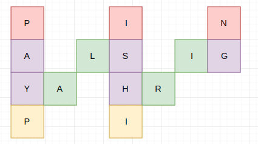

# LeetCode Part1

> 每天小刷几题，提神醒脑～

## 1. 两数之和

> 给定一个整数数组和一个目标值，找出数组中和为目标值的**两个**数。
>
> 你可以假设每个输入只对应一种答案，且同样的元素不能被重复利用。
>
> **示例:**
>
> ```
> 给定 nums = [2, 7, 11, 15], target = 9
> 
> 因为 nums[0] + nums[1] = 2 + 7 = 9
> 所以返回 [0, 1]
> ```

【解题思路】

> 相关话题：数组，哈希表

**方法1：暴力法**

遍历每个元素$x$，查找是否存在另一个数$target-x$。

时间复杂度$O(n^2)$    空间复杂度$O(1)$

**方法2：哈希表**

利用哈希表查找近似$O(1)$的特点，空间换时间；在进行迭代并将元素插入到表中的同时，我们还会回过头来检查表中是否已经存在当前元素所对应的目标元素。如果它存在，那我们已经找到了对应解，并立即将其返回。

时间复杂度：$O(n)$    空间复杂度：$O(n)$

【代码实现】

**方法1：暴力法**

```cpp
vector<int> twoSum(vector<int> &nums, int target) {
    int n = nums.size();
    for (int i = 0; i < n - 1; ++i) {
        for (int j = i + 1; j < n; ++j) {
            if (nums[i] + nums[j] == target)
                return {i, j};
        }
    }
    return {-1, -1};
}
```

**方法2：哈希表**

```cpp
vector<int> twoSum2(vector<int> &nums, int target) {
    unordered_map<int, int> table;
    int n = nums.size();
    for (int i = 0; i < n; ++i) {
        if (table.find(target - nums[i]) == table.end())
            table[nums[i]] = i;
        else
            return {table[target - nums[i]], i};
    }
    return {-1, -1};
}
```

## 2. 两数相加

> 给定两个**非空**链表来表示两个非负整数。位数按照**逆序**方式存储，它们的每个节点只存储单个数字。将两数相加返回一个新的链表。
>
> 你可以假设除了数字 0 之外，这两个数字都不会以零开头。
>
> **示例：**
>
> ```
> 输入：(2 -> 4 -> 3) + (5 -> 6 -> 4)
> 输出：7 -> 0 -> 8
> 原因：342 + 465 = 807
> ```

【解题思路】

> 相关话题：链表，数学

没什么特殊的技巧，就是按照加法准则进行即可。（但需注意的是：如果是直接在"输入链表中"直接修改则会相对麻烦一点---要处理选择的链表较短以及最后额外进1的情况）


【代码实现】

```cpp
ListNode *addTwoNumbers(ListNode *l1, ListNode *l2) {
    auto res = l1;
    int flag = 0;
    while (l1 || l2) {
        if (l1 && l2 && (l1->next == nullptr && l2->next)) {
            l1->next = l2->next;
            l2->next = nullptr;
        }
        if (l1 && l2) {
            auto val = l1->val + l2->val + flag;
            l1->val = val % 10;
            flag = val / 10;
            if (l1->next == nullptr && flag) {
                l1->next = new ListNode(0);
            }
            l1 = l1->next, l2 = l2->next;
        } else {
            auto val = l1->val + flag;
            l1->val = val % 10;
            flag = val / 10;
            if (l1->next == nullptr && flag) {
                l1->next = new ListNode(0);
            }
            l1 = l1->next;
        }

    }
    return res;
}
```

## 3. 无重复字符的最长子串

> 给定一个字符串，找出不含有重复字符的**最长子串**的长度。
>
> **示例 1:**
>
> ```
> 输入: "abcabcbb"
> 输出: 3 
> 解释: 无重复字符的最长子串是 "abc"，其长度为 3。
> ```
>
> **示例 2:**
>
> ```
> 输入: "bbbbb"
> 输出: 1
> 解释: 无重复字符的最长子串是 "b"，其长度为 1。
> ```
>
> **示例 3:**
>
> ```
> 输入: "pwwkew"
> 输出: 3
> 解释: 无重复字符的最长子串是 "wke"，其长度为 3。
>      请注意，答案必须是一个子串，"pwke" 是一个子序列 而不是子串。
> ```

【解题思路】

> 相关话题：哈希表，双指针，字符串

具体非常多种解法可以参考：[阅读解答](https://leetcode-cn.com/problems/longest-substring-without-repeating-characters/solution/)

滑动窗的思想：使用哈希表将字符存储在当前窗口 $[i, j)$（最初 $j = i$）中。 然后我们向右侧滑动索引$j$，如果它不在哈希表中，我们会继续滑动 $j$。直到 $s[j]$ 已经存在于哈希表中。此时，我们找到的没有重复字符的最长子字符串将会以索引 $i$ 开头。如果我们对所有的 $i$ 这样做，就可以得到答案。（合起来就一句话：始终保证窗口$[i,j)$内为不重复字母）

**下面的代码是上述思想的"改进"：主要为了更快的获得下一个起始位置$i$。（否则就要依次删除左边的对象来获得下一个起始位置）**

时间复杂度：$O(n)$， 空间复杂度：$O(min(m,n))$

【代码实现】

```cpp
int lengthOfLongestSubstring(string s) {
    int n = s.length(), cur = 0, res = 0;
    unordered_map<char, int> table;
    for (int i = 0; i < n; ++i) {
        if (table.find(s[i]) == table.end()) {
            table[s[i]] = i;
        } else {
            res = max(i - cur, res);
            cur = max(cur, table[s[i]] + 1);
            table[s[i]] = i;
        }
    }
    return max(res, n - cur);
}
```

## 4. 两个排序数组的中位数

> 给定两个大小为 m 和 n 的有序数组 **nums1** 和 **nums2** 。
>
> 请找出这两个有序数组的中位数。要求算法的时间复杂度为 $O(log (m+n))$ 。
>
> 你可以假设 **nums1** 和 **nums2** 不同时为空。
>
> **示例 1:**
>
> ```
> nums1 = [1, 3]
> nums2 = [2]
> 
> 中位数是 2.0
> ```
>
> **示例 2:**
>
> ```
> nums1 = [1, 2]
> nums2 = [3, 4]
> 
> 中位数是 (2 + 3)/2 = 2.5
> ```

【解题思路】

> 相关话题：数组，二分查找，分治算法
>
> 注：$O(m+n)$的方法倒是很简单

我们的"终极目标"是将两个数组拆分成下述情况：

```
          left_part          |        right_part
    A[0], A[1], ..., A[i-1]  |  A[i], A[i+1], ..., A[m-1]
    B[0], B[1], ..., B[j-1]  |  B[j], B[j+1], ..., B[n-1]
```

且满足：

1. `len(left_part)=len(right_part)`
2. `max(left_part)<=min(right_part)`

为了满足上述两个条件，我们只需要保证：（即寻找A的拆分方法中满足条件的情况）

1. `i+j=m-i+n-j`（或`m-i+n-j+1`）如果`n>=m`，只需要`i=0~m, j=(m+n+1)/2-i`
2. `B[j-1]<=A[i]`以及`A[i-1]<=B[j]`

> 在 $[0，m]$ 中搜索并找到目标对象 $i$，以使：
> $$
> B[j-1]\le A[i]\quad且A[i-1]\le B[j],其中j=\frac{m+n+1}{2}-i
> $$
>

后续就可以按照下面的步骤进行了：

1. 设 $imin = 0, imax=m$， 然后开始在 $[imin,imax]$ 中进行搜索。
2. 令$i=(imin+imax)/2,j=(m+n+1)/2-i$
3. 现在我们有 $len(left\_part)=len(right\_part)$。 而且我们只会遇到三种情况：
   - $B[j-1]\le A[i]$且$A[i-1]\le B[j]$：意味着找到了目标对象i，可以停止搜索
   - $B[j-1]>A[i]$：这意味着$A[i]$太小，我们需要调整i，即增大i
   - $A[i-1]>B[j]$：意味着$A[i-1]$太大

【代码实现】

```cpp
double findMedianSortedArrays(vector<int> &nums1, vector<int> &nums2) {
    int m = nums1.size(), n = nums2.size();
    if (m > n) {   // 保证m<n
        nums1.swap(nums2);
        swap(m, n);
    }
    int imin = 0, imax = m, halflen = (m + n + 1) / 2;
    while (imin <= imax) {
        int i = (imax + imin) / 2;
        int j = halflen - i;
        if (i < imax && nums2[j - 1] > nums1[i])
            imin = i + 1;
        else if (i > imin && nums1[i - 1] > nums2[j])
            imax = i - 1;
        else {
            int maxleft = 0;
            if (i == 0) maxleft = nums2[j - 1];
            else if (j == 0) maxleft = nums1[i - 1];
            else maxleft = max(nums1[i - 1], nums2[j - 1]);
            if ((m + n) % 2 == 1) return maxleft;

            int minright = 0;
            if (i == m) minright = nums2[j];
            else if (j == n) minright = nums1[i];
            else minright = min(nums2[j], nums1[i]);

            return (maxleft + minright) / 2.0;
        }
    }
    return 0.0;
}
```

## 5. 最长回文子串

> 给定一个字符串 **s**，找到 **s** 中最长的回文子串。你可以假设 **s** 的最大长度为1000。
>
> **示例 1：**
>
> ```
> 输入: "babad"
> 输出: "bab"
> 注意: "aba"也是一个有效答案。
> ```
>
> **示例 2：**
>
> ```
> 输入: "cbbd"
> 输出: "bb"
> ```

【解题思路】

> 相关话题：字符串，动态规划

#### 方法一：暴力法

很明显，暴力法将选出所有子字符串可能的开始和结束位置，并检验它是不是回文。（即检查所有的区间---需要$O(n^2)$，然后验证每个区间是否为回文---需要$O(n)$）

时间复杂度：$O(n^3)$，  空间复杂度：$O(1)$

#### 方法二：动态规划

为了改进暴力法，我们首先观察如何避免在验证回文时进行不必要的重复计算。考虑 $ababa$ 这个示例。如果我们已经知道$bab$ 是回文，那么很明显，$ababa$ 一定是回文，因为它的左首字母和右尾字母是相同的。

所以定义$P(i, j)$如下：
$$
P(i,j)=\begin{cases}true,\quad 如果字符串S_i...S_j是回文子串\\ false,\quad 其他情况\end{cases}
$$
因此：
$$
P(i,j)=(P(i+1,j-1)\ and\ S_i==S_j)
$$
这产生了一个直观的动态规划解法，我们首先初始化一字母和二字母的回文，然后找到所有三字母回文，并依此类推…

时间复杂度：$O(n^2)$， 空间复杂度：$O(n^2)$

#### 方法三：中心扩展算法

回文中心的两侧互为镜像。因此，回文可以从它的中心展开

时间复杂度：$O(n^2)​$， 空间复杂度：$O(1)​$

【代码实现】

```cpp
string longestPalindrome(string s) {
    int n = s.length(), res = n > 0 ? 1 : 0;
    int res_left = 0;
    for (int i = 0; i < n; ++i) {
        int left = i - 1, right = i + 1;
        while (left >= 0 && s[left] == s[i])
            --left;
        while (right < n && s[right] == s[i])
            ++right;
        while (left >= 0 && right < n && s[left] == s[right]) {
            --left;
            ++right;
        }
        if (right - left - 1 > res) {
            res = max(right - left - 1, res);
            res_left = left + 1;
        }
    }
    return s.substr(res_left, res);
}
```

## 6. Z字形变换

> 将字符串 `"PAYPALISHIRING"` 以Z字形排列成给定的行数：
>
> ```
> P   A   H   N
> A P L S I I G
> Y   I   R
> ```
>
> 之后从左往右，逐行读取字符：`"PAHNAPLSIIGYIR"`
>
> 实现一个将字符串进行指定行数变换的函数:
>
> ```
> string convert(string s, int numRows);
> ```
>
> **示例 1:**
>
> ```
> 输入: s = "PAYPALISHIRING", numRows = 3
> 输出: "PAHNAPLSIIGYIR"
> ```
>
> **示例 2:**
>
> ```
> 输入: s = "PAYPALISHIRING", numRows = 4
> 输出: "PINALSIGYAHRPI"
> 解释:
> 
> P     I    N
> A   L S  I G
> Y A   H R
> P     I
> ```

【解题思路】

> 相关话题：字符串



让我们来找下规律吧，按行来看看各个位置和原本下标之间的关系：

1. 第0行（因为下标从0开始）：每个数之间的间隔为`2×numRows-2`
2. 第numRows-1行（即最后一行）：每个数之间的间隔为`2×numRows-2`
3. 第k行：每个"紫块"之间间隔`2xnumRows-2`，但是之间"夹杂"的"绿色"与前一个之间的间隔为`2xnumRows-2-2×k`

> 注：对于numRows=1的情况直接返回

时间复杂度：$O(n)$， 空间复杂度：$O(n)$

【代码实现】

```cpp
string convert(string s, int numRows) {
    if (numRows == 1) return s;
    int n = s.length(), step = 2 * numRows - 2;
    string res;
    for (int i = 0; i < numRows; ++i) {
        for (int j = i; j < n; j += step) {
            res.push_back(s[j]);
            if (i > 0 && i < numRows - 1 && (j + step - 2 * i < n))
                res.push_back(s[j + step - 2 * i]);
        }
    }
    return res;
}
```

## 7. 反转整数

> 给定一个 32 位有符号整数，将整数中的数字进行反转。
>
> **示例 1:**
>
> ```
> 输入: 123
> 输出: 321
> ```
>
>  **示例 2:**
>
> ```
> 输入: -123
> 输出: -321
> ```
>
> **示例 3:**
>
> ```
> 输入: 120
> 输出: 21
> ```
>
> **注意:**
>
> 假设我们的环境只能存储 32 位有符号整数，其数值范围是 $[−2^{31},  2^{31} − 1]$。根据这个假设，如果反转后的整数溢出，则返回 0。

【解题思路】

> 相关话题：数学

主要的"难点"在于溢出检查（分别考虑正负数的溢出问题）

正数情况 --- 如果`res=res*10+x%10`会溢出，则一定有`res>=INT_MAX/10`，那么可以分为下属情况

1. 如果`res>INT_MAX/10`，则一定溢出
2. 如果`res=INT_MAX/10`，那么只要`x%10>7`则一定溢出

负数情况 --- 如果`res=res*10+x%10`会溢出，则一定有`res<=INT_MIN/10`，那么可以分为下属情况

1. 如果`res<INT_MIN/10`，则一定溢出
2. 如果`res=INT_MIN/10`，那么只要`x%10<-8`则一定溢出

> 友情提示：`-9%10=-9, -9/10=0`（即余数总是会保留符号的那一侧）

【代码实现】

```cpp
int reverse(int x) {
    int res = 0;
    while (x != 0) {
        if (res > numeric_limits<int>::max() / 10 || (res == numeric_limits<int>::max() / 10 && x % 10 > 7)) return 0;
        if (res < numeric_limits<int>::min() / 10 || (res == numeric_limits<int>::min() / 10 && x % 10 < -8)) return 0;
        res = res * 10 + x % 10;
        x /= 10;
    }
    return res;
}
```

## 8. 字符串转整数 (atoi)

> 实现 `atoi`，将字符串转为整数。
>
> 该函数首先根据需要丢弃任意多的空格字符，直到找到第一个非空格字符为止。如果第一个非空字符是正号或负号，选取该符号，并将其与后面尽可能多的连续的数字组合起来，这部分字符即为整数的值。如果第一个非空字符是数字，则直接将其与之后连续的数字字符组合起来，形成整数。
>
> 字符串可以在形成整数的字符后面包括多余的字符，这些字符可以被忽略，它们对于函数没有影响。
>
> 当字符串中的第一个非空字符序列不是个有效的整数；或字符串为空；或字符串仅包含空白字符时，则不进行转换。
>
> 若函数不能执行有效的转换，返回 0。
>
> **说明：**
>
> 假设我们的环境只能存储 32 位有符号整数，其数值范围是 $[−2^{31},  2^{31} − 1]$。如果数值超过可表示的范围，则返回  INT_MAX ($2^{31} − 1$) 或 INT_MIN ($−2^{31}$) 。
>
> **示例 1:**
>
> ```
> 输入: "42"
> 输出: 42
> ```
>
> **示例 2:**
>
> ```
> 输入: "   -42"
> 输出: -42
> 解释: 第一个非空白字符为 '-', 它是一个负号。
>      我们尽可能将负号与后面所有连续出现的数字组合起来，最后得到 -42 。
> ```
>
> **示例 3:**
>
> ```
> 输入: "4193 with words"
> 输出: 4193
> 解释: 转换截止于数字 '3' ，因为它的下一个字符不为数字。
> ```
>
> **示例 4:**
>
> ```
> 输入: "words and 987"
> 输出: 0
> 解释: 第一个非空字符是 'w', 但它不是数字或正、负号。
>      因此无法执行有效的转换。
> ```
>
> **示例 5:**
>
> ```
> 输入: "-91283472332"
> 输出: -2147483648
> 解释: 数字 "-91283472332" 超过 32 位有符号整数范围。 
>      因此返回 INT_MIN (−2^31) 。
> ```

【解题思路】

> 相关话题：数字，字符串

主要按照下述几个步骤来达到题目所给出的限制：（用start代表当前所在字符串位置）

1. 跳过"开头的空格" --- 遇到空格start+1
2. 判断符号 --- 利用flag记录正负情况
3. 依次遍历数字，并加上去（考虑溢出的情况---如第7题所示）

【代码实现】

```cpp
int myAtoi(string str) {
    int n = str.length(), start = 0, res = 0, flag = 1;
    while (start < n && str[start] == ' ')
        ++start;
    if (str[start] == '+' || str[start] == '-') {
        flag = str[start] == '+' ? 1 : -1;
        ++start;
    }
    while (start < n && str[start] >= '0' && str[start] <= '9') {
        if (flag == 1 && (res > numeric_limits<int>::max() / 10 ||
                          (res == numeric_limits<int>::max() / 10 && str[start] - '0' > 7)))
            return numeric_limits<int>::max();
        if (flag == -1 && (res < numeric_limits<int>::min() / 10 ||
                           (res == numeric_limits<int>::min() / 10 && str[start] - '0' > 8)))
            return numeric_limits<int>::min();
        res = res * 10 + flag * (str[start] - '0');
        ++start;
    }
    return res;
}
```

## 9. 回文数

> 判断一个整数是否是回文数。回文数是指正序（从左向右）和倒序（从右向左）读都是一样的整数。
>
> **示例 1:**
>
> ```
> 输入: 121
> 输出: true
> ```
>
> **示例 2:**
>
> ```
> 输入: -121
> 输出: false
> 解释: 从左向右读, 为 -121 。 从右向左读, 为 121- 。因此它不是一个回文数。
> ```
>
> **示例 3:**
>
> ```
> 输入: 10
> 输出: false
> 解释: 从右向左读, 为 01 。因此它不是一个回文数。
> ```
>
> **进阶:**
>
> 你能不将整数转为字符串来解决这个问题吗？

【解题思路】

> 相关话题：数学

#### 方法1：转为字符串

首先，如果$x<0$，则直接返回false就好了；再将其转为字符串，采用两端双指针向中间逼近的方式检查即可。

#### 方法2：不转为字符串

按下述几个步骤进行：

1. 首先先确定该数的"位数"(k) --- 比如121对应的位数为100
2. 检查`x/k`是否等于`x%10` --- 如果不等于直接fasle，等于则进行下述操作
3. 令`k/100`，`x%k, x/10`；在循环到2

> 简言之：将字符串的两端逼近以数字乘除的方式进行

【代码实现】

#### 方法1

```cpp
// 最简单的方式 --- 转为字符串
bool isPalindrome(int x) {
    if (x < 0) return false;
    string s = to_string(x);
    int n = s.length();
    for (int i = 0, j = n - 1; i < j; ++i, --j) {
        if (s[i] != s[j])
            return false;
    }
    return true;
}
```

#### 方法2

```cpp
// 不转为字符串的方式
bool isPalindrome2(int x) {
    if (x < 0) return false;
    int tmp = x, left = 1;
    while (tmp > 9) {
        tmp /= 10;
        left *= 10;
    }
    while (left) {
        if (x / left != x % 10) return false;
        x %= left;
        x /= 10;
        left /= 100;
    }
    return true;
}
```

