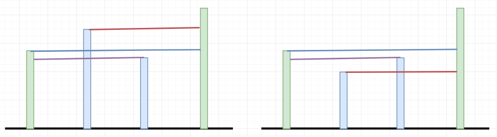
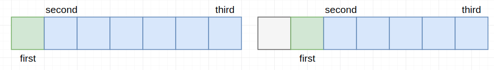
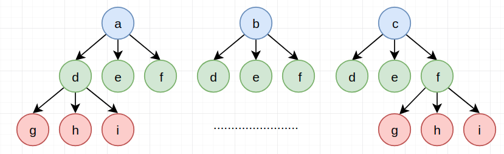
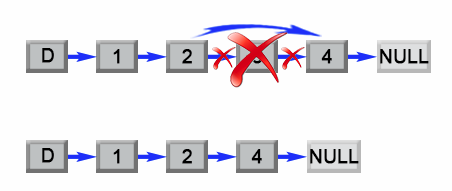
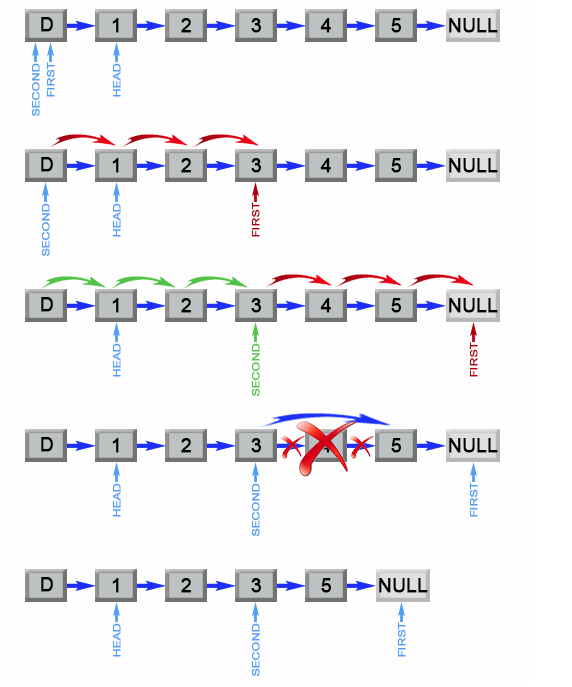

# LeetCode Part2

> 每天小刷几题，提神醒脑～

## 11. 盛最多水的容器

给定 *n* 个非负整数 $a_1，a_2，...，a_n$，每个数代表坐标中的一个点 $(i, a_i)$ 。在坐标内画 *n* 条垂直线，垂直线 *i* 的两个端点分别为 $(i, a_i)$ 和 $(i, 0)$。找出其中的两条线，使得它们与 *x* 轴共同构成的容器可以容纳最多的水。

**说明：**你不能倾斜容器，且 *n* 的值至少为 2。


图中垂直线代表输入数组 [1,8,6,2,5,4,8,3,7]。在此情况下，容器能够容纳水（表示为蓝色部分）的最大值为 49。 

**示例:**

```
输入: [1,8,6,2,5,4,8,3,7]
输出: 49
```

【解题思路】

> 相关话题：数组，双指针

双指针的方式：（p1=0，p2=n-1）

给出下述"直观结论"：如果我们非要对p1和p2中的某个进行移动，显然移动那个"短的"才有可能比原来的面积大，移动"长的"是不可能使得面积比原来大的（那就很容易了，我们每次只移动"短的"，这样才有变大的可能），所以全部只有两种情况：（只要记录所有"有可能变大"的情况中最大的即可）

1. `height[p1]<height[p2]`：则将`p1+=1`
2. `height[p1]>=height[p2]`：则将`p2-=1`



时间复杂度：$O(n)$，  空间复杂度：$O(1)$

【代码实现】

```cpp
int maxArea(vector<int> &height) {
    int res = 0, i = 0, j = height.size() - 1;
    while (i < j) {
        res = max(min(height[i], height[j]) * (j - i), res);
        if (height[i] < height[j]) ++i;
        else --j;
    }
    return res;
}
```

## 12. 整数转罗马数字

> 罗马数字包含以下七种字符： `I`， `V`， `X`， `L`，`C`，`D` 和 `M`。
>
> ```
> 字符          数值
> I             1
> V             5
> X             10
> L             50
> C             100
> D             500
> M             1000
> ```
>
> 例如， 罗马数字 2 写做 `II` ，即为两个并列的 1。12 写做 `XII` ，即为 `X` + `II` 。 27 写做  `XXVII`, 即为 `XX` + `V` + `II` 。
>
> 通常情况下，罗马数字中小的数字在大的数字的右边。但也存在特例，例如 4 不写做 `IIII`，而是 `IV`。数字 1 在数字 5 的左边，所表示的数等于大数 5 减小数 1 得到的数值 4 。同样地，数字 9 表示为 `IX`。这个特殊的规则只适用于以下六种情况：
>
> - `I` 可以放在 `V` (5) 和 `X` (10) 的左边，来表示 4 和 9。
> - `X` 可以放在 `L` (50) 和 `C` (100) 的左边，来表示 40 和 90。 
> - `C` 可以放在 `D` (500) 和 `M` (1000) 的左边，来表示 400 和 900。
>
> 给定一个整数，将其转为罗马数字。输入确保在 1 到 3999 的范围内。
>
> **示例 1:**
>
> ```
> 输入: 3
> 输出: "III"
> ```
>
> **示例 2:**
>
> ```
> 输入: 4
> 输出: "IV"
> ```
>
> **示例 3:**
>
> ```
> 输入: 9
> 输出: "IX"
> ```
>
> **示例 4:**
>
> ```
> 输入: 58
> 输出: "LVIII"
> 解释: L = 50, V = 5, III = 3.
> ```
>
> **示例 5:**
>
> ```
> 输入: 1994
> 输出: "MCMXCIV"
> 解释: M = 1000, CM = 900, XC = 90, IV = 4.
> ```

【解题思路】

> 相关话题：数学，字符串

其实对于每一位上的数字我们都可以"预先将其表示出来"：

```
 1    2      3     4     5    6      7      8      9
"I", "II", "III", "IV", "V", "VI", "VII", "VIII", "IX"
"X", "XX", "XXX", "XL", "L", "LX", "LXX", "LXXX", "XC"
"C", "CC", "CCC", "CD", "D", "DC", "DCC", "DCCC", "CM"
"M", "MM", "MMM"
```

之后我们只需要依次从高位计算对应位置的数字，再将其对应的罗马字符加上即可。

时间复杂度：$O(1)$，  空间复杂度：$O(1)$  

【代码实现】

```cpp
vector<vector<string>> dig{{"I", "II", "III", "IV", "V", "VI", "VII", "VIII", "IX"},
                           {"X", "XX", "XXX", "XL", "L", "LX", "LXX", "LXXX", "XC"},
                           {"C", "CC", "CCC", "CD", "D", "DC", "DCC", "DCCC", "CM"},
                           {"M", "MM", "MMM"}};

string intToRoman(int num) {
    string res;
    int div = 1000, idx = 3;
    while (num) {
        int t = num / div;
        if (t) res += dig[idx][t-1];
        num %= div;
        div /= 10, idx -= 1;
    }
    return res;
}
```

## 13. 罗马数字转整数

> 罗马数字包含以下七种字符: `I`， `V`， `X`， `L`，`C`，`D` 和 `M`。
>
> ```
> 字符          数值
> I             1
> V             5
> X             10
> L             50
> C             100
> D             500
> M             1000
> ```
>
> 例如， 罗马数字 2 写做 `II` ，即为两个并列的 1。12 写做 `XII` ，即为 `X` + `II` 。 27 写做  `XXVII`, 即为 `XX` + `V` + `II` 。
>
> 通常情况下，罗马数字中小的数字在大的数字的右边。但也存在特例，例如 4 不写做 `IIII`，而是 `IV`。数字 1 在数字 5 的左边，所表示的数等于大数 5 减小数 1 得到的数值 4 。同样地，数字 9 表示为 `IX`。这个特殊的规则只适用于以下六种情况：
>
> - `I` 可以放在 `V` (5) 和 `X` (10) 的左边，来表示 4 和 9。
> - `X` 可以放在 `L` (50) 和 `C` (100) 的左边，来表示 40 和 90。 
> - `C` 可以放在 `D` (500) 和 `M` (1000) 的左边，来表示 400 和 900。
>
> 给定一个罗马数字，将其转换成整数。输入确保在 1 到 3999 的范围内。
>
> **示例 1:**
>
> ```
> 输入: "III"
> 输出: 3
> ```
>
> **示例 2:**
>
> ```
> 输入: "IV"
> 输出: 4
> ```
>
> **示例 3:**
>
> ```
> 输入: "IX"
> 输出: 9
> ```
>
> **示例 4:**
>
> ```
> 输入: "LVIII"
> 输出: 58
> 解释: L = 50, V= 5, III = 3.
> ```
>
> **示例 5:**
>
> ```
> 输入: "MCMXCIV"
> 输出: 1994
> 解释: M = 1000, CM = 900, XC = 90, IV = 4.
> ```

【解题思路】

> 相关话题：数学，字符串

step1：利用哈希表先建立映射关系table

```
 I      V      X      L      C      D      M
 1      5      10     50     100    500    1000
```

step2：依次遍历每个字符，采用下述规则

1. 该字符比下一个字符对应的映射关系数字大，则加上该字符对应的数字
2. 该字符比下一个字符对应的映射关系数字小，则减去该字符对应的数字

（你稍微观察下就会发现只有这两种情况）

时间复杂度：$O(n)$， 空间复杂度：$O(1)$

【代码实现】

```cpp
unordered_map<char, int> table{{'I', 1},
                               {'V', 5},
                               {'X', 10},
                               {'L', 50},
                               {'C', 100},
                               {'D', 500},
                               {'M', 1000}};

int romanToInt(string s) {
    int n = s.length(), res = 0;
    for (int i = 0; i < n; ++i) {
        if (i + 1 < n && table[s[i]] < table[s[i + 1]]) {
            res -= table[s[i]];
        } else
            res += table[s[i]];
    }
    return res;
}
```

## 14. 最长公共前缀

> 编写一个函数来查找字符串数组中的最长公共前缀。
>
> 如果不存在公共前缀，返回空字符串 `""`。
>
> **示例 1:**
>
> ```
> 输入: ["flower","flow","flight"]
> 输出: "fl"
> ```
>
> **示例 2:**
>
> ```
> 输入: ["dog","racecar","car"]
> 输出: ""
> 解释: 输入不存在公共前缀。
> ```
>
> **说明:**
>
> 所有输入只包含小写字母 `a-z` 。

【解题思路】

> 相关话题：字符串

非常简单的一道题，我们只需依次取第一个字符串的字母，然后与后续字符串进行比较是否相同，终止条件：

1. 当所取字母的位置超过后续字符串的长度
2. 后续字符串同位置非该字母

时间复杂度：$O(n\times k)$ ， 空间复杂度：$O(1)$（如果考虑返回的大小，则为$O(k)$）

【代码实现】

```cpp
string longestCommonPrefix(vector<string> &strs) {
    int n = strs.size();
    int l = n > 0 ? strs[0].length() : 0;
    string res;
    for (int i = 0; i < l; ++i) {
        char c = strs[0][i];
        for (int k = 1; k < n; ++k) {
            if (i >= strs[k].length() || strs[k][i] != c)
                return res;
        }
        res.push_back(c);
    }
    return res;
}
```

## 15. 三数之和

> 给定一个包含 *n* 个整数的数组 `nums`，判断 `nums` 中是否存在三个元素 *a，b，c ，*使得 *a + b + c =* 0 ？找出所有满足条件且不重复的三元组。
>
> **注意：**答案中不可以包含重复的三元组。
>
> ```
> 例如, 给定数组 nums = [-1, 0, 1, 2, -1, -4]，
> 
> 满足要求的三元组集合为：
> [
>   [-1, 0, 1],
>   [-1, -1, 2]
> ]
> ```

【解题思路】

> 相关话题：数组，双指针

step1：先对数组进行排序

step2：固定first，对`(first, end]`采用双指针进行搜索满足`first+second+third=0`的所有情况



由于是有序的数组，second和third可以在$O(n)$时间内完成遍历

现在还需处理的是重复的问题，可以有两种解决方案：

1. 直接采用set来存储，之后再转为vector即可
2. "跳过同样的情况"：
   - 外层循环：下一次的first和前一次的first相同时，跳过此次first
   - 内层循环：每次找到满足`first+second+third=0`的情况时，跳过和此时second和third相同的数字

时间复杂度：$O(n^2)$，  空间复杂度：$O(1)$

【代码实现】

```cpp
vector<vector<int>> threeSum(vector<int> &nums) {
    sort(nums.begin(), nums.end());
    int n = nums.size();
    vector<vector<int>> res;
    for (int i = 0; i < n - 2; ++i) {
        int first = nums[i];
        if (i - 1 >= 0 && first == nums[i - 1]) continue;
        for (int j = i + 1, k = n - 1; j < k;) {
            auto second = nums[j], third = nums[k];
            if (first + second + third == 0) {
                res.push_back({first, second, third});
                ++j, --k;
                while (j < k && nums[j] == second) ++j;
                while (k > j && nums[k] == third) --k;
            } else if (first + second + third > 0)
                --k;
            else ++j;
        }
    }
    return res;
}
```

## 16. 最接近的三数之和

> 给定一个包括 *n* 个整数的数组 `nums` 和 一个目标值 `target`。找出 `nums` 中的三个整数，使得它们的和与 `target` 最接近。返回这三个数的和。假定每组输入只存在唯一答案。
>
> ```
> 例如，给定数组 nums = [-1，2，1，-4], 和 target = 1.
> 
> 与 target 最接近的三个数的和为 2. (-1 + 2 + 1 = 2).
> ```

【解题思路】

> 相关话题：数组，双指针

思路和15是完全一样的，只是在条件语句时有些变化。主要的几点不同：

1. 不用考虑"相同值"的情况
2. 判断的标准是`first+second+third`与`target`之间的差异

时间复杂度：$O(n^2)$，  空间复杂度：$O(1)$

【代码实现】

```cpp
int threeSumClosest(vector<int> &nums, int target) {
    sort(nums.begin(), nums.end());
    int res = numeric_limits<int>::max(), gap = numeric_limits<int>::max();
    int n = nums.size();
    for (int i = 0; i < n - 2; ++i) {
        int first = nums[i];
        for (int j = i + 1, k = n - 1; j < k;) {
            auto three = first + nums[j] + nums[k];
            if (abs(target - three) < gap) {
                gap = abs(target - three);
                res = three;
            }
            if (target == three)
                return target;
            else if (target > three)
                ++j;
            else --k;
        }
    }
    return res;
}
```

## 17. 电话号码的字母组合

> 给定一个仅包含数字 `2-9` 的字符串，返回所有它能表示的字母组合。
>
> 给出数字到字母的映射如下（与电话按键相同）。注意 1 不对应任何字母。
>
> 
>
> **示例:**
>
> ```
> 输入："23"
> 输出：["ad", "ae", "af", "bd", "be", "bf", "cd", "ce", "cf"].
> ```
>
> **说明:**
> 尽管上面的答案是按字典序排列的，但是你可以任意选择答案输出的顺序。

【解题思路】

> 相关话题：字符串，回溯算法

#### 方法1：利用队列

令队列里保存执行完前一个数字之后包含的所有字符串。则在进入下一个数字时，我们依次取出队列里的字符串，令每个字符串加上该数字的所有可能。再放回队列即可。

> 当然，也可以不借助队列，直接在vector上面进行操作。

时间复杂度：$O(3^n\sim 4^n)$， 空间复杂度$O(3^n\sim 4^n)$

#### 方法2：回溯方式（深度优先搜索）



就按照深度优先搜索方法进行下去就好，采用idx来表示深度，当深度=digits的长度时，保存

【代码实现】

#### 方法1

```cpp
vector<string> table{"abc", "def", "ghi", "jkl", "mno", "pqrs", "tuv", "wxyz"};

vector<string> letterCombinations(string digits) {
    queue<string> q;
    for (auto num: digits) {
        int n = q.size();
        if (n == 0) {
            for (auto a: table[num - '0' - 2])
                q.push(string(1, a));
        } else {
            for (int i = 0; i < n; ++i) {
                auto tmp = q.front();
                q.pop();
                for (auto a: table[num - '0' - 2])
                    q.push(tmp + string(1, a));
            }
        }
    }
    vector<string> res;
    while (!q.empty()) {
        auto tmp = q.front();
        res.push_back(tmp);
        q.pop();
    }
    return res;
}
```

#### 方法2

```cpp
vector<string> table{"abc", "def", "ghi", "jkl", "mno", "pqrs", "tuv", "wxyz"};

void helper(string digits, int idx, string s, vector<string> &res) {
    if (idx == digits.size()) res.push_back(s);
    else {
        for (auto a: table[digits[idx] - '0' - 2]) {
            s.push_back(a);
            helper(digits, idx + 1, s, res);
            s.pop_back();
        }
    }
}

vector<string> letterCombinations2(string digits) {
    if (digits.size() == 0) return {};
    vector<string> res;
    string s;
    helper(digits, 0, s, res);
    return res;
}
```

## 18. 四数之和

> 给定一个包含 *n* 个整数的数组 `nums` 和一个目标值 `target`，判断 `nums` 中是否存在四个元素 *a*，*b*，*c* 和 *d* ，使得 *a* + *b* + *c* + *d* 的值与 `target` 相等？找出所有满足条件且不重复的四元组。
>
> **注意：**
>
> 答案中不可以包含重复的四元组。
>
> **示例：**
>
> ```
> 给定数组 nums = [1, 0, -1, 0, -2, 2]，和 target = 0。
> 
> 满足要求的四元组集合为：
> [
>   [-1,  0, 0, 1],
>   [-2, -1, 1, 2],
>   [-2,  0, 0, 2]
> ]
> ```

【解题思路】

> 相关话题：数组，哈希表，双指针

和[三数之和](https://leetcode-cn.com/problems/3sum)思想是完全一样的，多嵌套一层循环即可。这个实现版本为了方便，采用set不能重复的特性来实现。

时间复杂度：$O(n^3)$，  空间复杂度：$O(4n^4)$（理论上的上界）

【代码实现】

```cpp
vector<vector<int>> fourSum(vector<int> &nums, int target) {
    sort(nums.begin(), nums.end());
    set<vector<int>> res;
    int n = nums.size();
    for (int i = 0; i < n - 3; ++i) {
        for (int j = i + 1; j < n - 2; ++j) {
            for (int k = j + 1, l = n - 1; k < l;) {
                int s = nums[i] + nums[j] + nums[k] + nums[l];
                if (s == target) {
                    res.insert({nums[i], nums[j], nums[k], nums[l]});
                    ++k, --l;
                } else if (s > target) --l;
                else ++k;
            }
        }
    }
    return vector<vector<int>>(res.begin(), res.end());
}
```

## 19. 删除链表的倒数第N个节点

> 给定一个链表，删除链表的倒数第 *n* 个节点，并且返回链表的头结点。
>
> **示例：**
>
> ```
> 给定一个链表: 1->2->3->4->5, 和 n = 2.
> 
> 当删除了倒数第二个节点后，链表变为 1->2->3->5.
> ```
>
> **说明：**
>
> 给定的 *n* 保证是有效的。
>
> **进阶：**
>
> 你能尝试使用一趟扫描实现吗？

【解题思路】

> 相关话题：链表，双指针

#### 方法1：两次遍历



第一遍：获得链表的长度l

第二遍：走到l-n的地方，再删除该节点的下一个节点

#### 方法2：一次遍历

利用两个指针：



step1：先让指针first走n步，指针second不动

step2：同时移动指针first和seconde，直到first走到nullptr，此时second就刚好走到了要删除节点前一个位置

时间复杂度：$O(n)$，  空间复杂度：$O(1)$

【代码实现】

#### 方法1

```cpp
ListNode *removeNthFromEnd(ListNode *head, int n) {
    ListNode *tmp = head;
    int l = 0;
    while (tmp) {
        ++l;
        tmp = tmp->next;
    }
    int k = l - n;
    tmp = head;
    for (int i = 0; i < k - 1; ++i)
        tmp = tmp->next;
    if (tmp == head) {
        auto t = head;
        head = head->next;
        delete (t);
    } else {
        auto t = tmp->next;
        tmp->next = tmp->next->next;
        delete (t);
    }
    return head;
}
```

#### 方法2

```cpp
ListNode *removeNthFromEnd2(ListNode *head, int n) {
    ListNode *first = head, *second = head;
    for (int i = 0; i < n; ++i)
        first = first->next;
    if (!first) {
        head = head->next;
        delete (second);
        return head;
    }
    while (first->next) {
        first = first->next;
        second = second->next;
    }
    auto tmp = second->next;
    second->next = second->next->next;
    delete (tmp);
    return head;
}
```

## 20. 有效的括号

> 给定一个只包括 `'('`，`')'`，`'{'`，`'}'`，`'['`，`']'` 的字符串，判断字符串是否有效。
>
> 有效字符串需满足：
>
> 1. 左括号必须用相同类型的右括号闭合。
> 2. 左括号必须以正确的顺序闭合。
>
> 注意空字符串可被认为是有效字符串。
>
> **示例 1:**
>
> ```
> 输入: "()"
> 输出: true
> ```
>
> **示例 2:**
>
> ```
> 输入: "()[]{}"
> 输出: true
> ```
>
> **示例 3:**
>
> ```
> 输入: "(]"
> 输出: false
> ```
>
> **示例 4:**
>
> ```
> 输入: "([)]"
> 输出: false
> ```
>
> **示例 5:**
>
> ```
> 输入: "{[]}"
> 输出: true
> ```

【解题思路】

> 相关话题：栈，字符串

step1：先用set保存`(,[,{`三种情况，以及利用哈希表建立`)->(, ]->[, }->{`的映射关系

step2：遍历字符串，如果出现`([{`的情况则入栈，出现`)]}`，则出栈顶元素，看两者之间是否满足映射关系，如果不满足直接返回false。满足不断进行下去

step3：最后只有栈为空才为true

时间复杂度：$O(n)$，  空间复杂度：$O(n)$

【代码实现】

```cpp
unordered_set<char> setin{'(', '[', '{'};
unordered_map<char, char> table{{')', '('},
                                {']', '['},
                                {'}', '{'}};

bool isValid(string s) {
    stack<char> contain;
    for (auto c: s) {
        if (setin.count(c))
            contain.push(c);
        else {
            if (contain.empty() || contain.top() != table[c]) return false;
            else contain.pop();
        }
    }
    return contain.empty() ? true : false;
}
```

