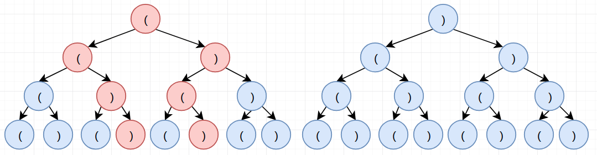
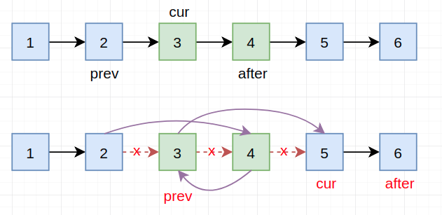

# LeetCode Part3

> 每天小刷几题，提神醒脑～

## 21. 合并两个有序链表

> 将两个有序链表合并为一个新的有序链表并返回。新链表是通过拼接给定的两个链表的所有节点组成的。 
>
> **示例：**
>
> ```
> 输入：1->2->4, 1->3->4
> 输出：1->1->2->3->4->4
> ```

【解题思路】

> 相关话题：链表

就是按照题意，遍历两个链表进行比较即可。

【代码实现】

```cpp
ListNode *mergeTwoLists(ListNode *l1, ListNode *l2) {
    ListNode *res = new ListNode(-1);
    ListNode *tmp = res;
    while (l1 || l2) {
        if (l1 == nullptr) {
            tmp->next = l2;
            break;
        } else if (l2 == nullptr) {
            tmp->next = l1;
            break;
        } else if (l1->val < l2->val) {
            tmp->next = l1;
            l1 = l1->next;
        } else {
            tmp->next = l2;
            l2 = l2->next;
        }
        tmp = tmp->next;
    }
    tmp = res;
    res = res->next;
    delete (tmp);
    return res;
}
```

## 22. 括号生成

> 给出 *n* 代表生成括号的对数，请你写出一个函数，使其能够生成所有可能的并且**有效的**括号组合。
>
> 例如，给出 *n* = 3，生成结果为：
>
> ```
> [
>   "((()))",
>   "(()())",
>   "(())()",
>   "()(())",
>   "()()()"
> ]
> ```

【解题思路】

> 相关话题：字符串，回溯算法

下面以n=2为例：



其中红色的代表符合条件的路径。因此此问题其实就是"加约束"的深度优先搜索，我们来给出"约束"：（用left和right分别代表`(`和`)`出现的次数）

1. 满足条件的情况：`left=n, right=n`
2. 当`left<right`：直接不满足条件，跳过
3. 当`left==n`时，只管加`)`即可
4. 当`left=right`时：只能加`(`
5. 当`left>right`时：既可以加`(`，也可以加`)`

【代码实现】

```cpp
vector<char> arr{'(', ')'};

void helper(int left, int right, string s, int n, vector<string> &res) {
    if (left == n && right == n) res.push_back(s);
    else if (left <= right) {
        s.push_back(arr[0]);
        helper(left + 1, right, s, n, res);
    } else if (left == n) {
        s.push_back(arr[1]);
        helper(left, right + 1, s, n, res);
    } else if (left < right) {
        return;
    } else {
        for (int i = 0; i < 2; ++i) {
            s.push_back(arr[i]);
            if (i == 0) left += 1;
            else right += 1;
            helper(left, right, s, n, res);
            s.pop_back();
            if (i == 0) left -= 1;
            else right -= 1;
        }
    }
}

vector<string> generateParenthesis(int n) {
    vector<string> res;
    helper(0, 0, "", n, res);
    return res;
}
```

## 23. 合并K个排序链表

> 合并 *k* 个排序链表，返回合并后的排序链表。请分析和描述算法的复杂度。
>
> **示例:**
>
> ```
> 输入:
> [
>   1->4->5,
>   1->3->4,
>   2->6
> ]
> 输出: 1->1->2->3->4->4->5->6
> ```

【解题思路】


## 24. 两两交换链表中的节点

> 给定一个链表，两两交换其中相邻的节点，并返回交换后的链表。
>
> **示例:**
>
> ```
> 给定 1->2->3->4, 你应该返回 2->1->4->3.
> ```
>
> **说明:**
>
> - 你的算法只能使用常数的额外空间。
> - **你不能只是单纯的改变节点内部的值**，而是需要实际的进行节点交换。

【解题思路】

> 相关话题：链表

关于链表的问题，其实更核心的是理清指针之间的关系：



从上图我们很容易看到利用三个指针即可完成任务，切之间的变化关系如下：

1. "前后关系"：

   ```cpp
   cur->next = after->next;
   after->next = cur;
   prev->next = after;
   ```

2. "位置关系"：

   ```cpp
   prev = cur;
   cur = cur->next;
   after = cur ? cur->next : nullptr;
   ```

其中稍微注意的是`prev`可以初始化一个"链表头"，然后指向链表即可

时间复杂度：$O(n)$，  空间复杂度：$O(1)$

【代码实现】

```cpp
ListNode *swapPairs(ListNode *head) {
    ListNode *prev = new ListNode(-1), *cur = head, *after = head ? head->next : nullptr;
    prev->next = head;
    ListNode *res = prev;
    while (after) {
        cur->next = after->next;
        after->next = cur;
        prev->next = after;
        prev = cur;
        cur = cur->next;
        after = cur ? cur->next : nullptr;
    }
    return res->next;
}
```

## 25. k个一组翻转链表

> 给出一个链表，每 *k* 个节点一组进行翻转，并返回翻转后的链表。
>
> *k* 是一个正整数，它的值小于或等于链表的长度。如果节点总数不是 *k* 的整数倍，那么将最后剩余节点保持原有顺序。
>
> **示例 :**
>
> 给定这个链表：`1->2->3->4->5`
>
> 当 *k* = 2 时，应当返回: `2->1->4->3->5`
>
> 当 *k* = 3 时，应当返回: `3->2->1->4->5`
>
> **说明 :**
>
> - 你的算法只能使用常数的额外空间。
> - **你不能只是单纯的改变节点内部的值**，而是需要实际的进行节点交换。


## 26. 删除排序数组中的重复项

> 给定一个排序数组，你需要在**原地**删除重复出现的元素，使得每个元素只出现一次，返回移除后数组的新长度。
>
> 不要使用额外的数组空间，你必须在**原地修改输入数组**并在使用 O(1) 额外空间的条件下完成。
>
> **示例 1:**
>
> ```
> 给定数组 nums = [1,1,2], 
> 
> 函数应该返回新的长度 2, 并且原数组 nums 的前两个元素被修改为 1, 2。 
> 
> 你不需要考虑数组中超出新长度后面的元素。
> ```
>
> **示例 2:**
>
> ```
> 给定 nums = [0,0,1,1,1,2,2,3,3,4],
> 
> 函数应该返回新的长度 5, 并且原数组 nums 的前五个元素被修改为 0, 1, 2, 3, 4。
> 
> 你不需要考虑数组中超出新长度后面的元素。
> ```
>
> **说明:**
>
> 为什么返回数值是整数，但输出的答案是数组呢?
>
> 请注意，输入数组是以**“引用”**方式传递的，这意味着在函数里修改输入数组对于调用者是可见的。
>
> 你可以想象内部操作如下:
>
> ```
> // nums 是以“引用”方式传递的。也就是说，不对实参做任何拷贝
> int len = removeDuplicates(nums);
> 
> // 在函数里修改输入数组对于调用者是可见的。
> // 根据你的函数返回的长度, 它会打印出数组中该长度范围内的所有元素。
> for (int i = 0; i < len; i++) {
>     print(nums[i]);
> }
> ```

【解题思路】

> 相关话题：数组，双指针

双指针策略：

1. cur表示当前"符合"条件的位置
2. `j`从`[1, end]`，每当遇见`nums[cur]!=nums[j]`的时候，令`nums[cur+1]=nums[j], cur+=1`。否则，只移动`j`

时间复杂度：$O(n)$，  空间复杂度：$O(1)$

【代码实现】

```cpp
int removeDuplicates(vector<int> &nums) {
    int cur = 0;
    for (int j = 1; j < nums.size(); ++j) {
        if (nums[j] != nums[cur])
            nums[++cur] = nums[j];
    }
    return nums.size() == 0 ? cur : cur + 1;
}
```

## 27. 移除元素

> 给定一个数组 *nums* 和一个值 *val*，你需要**原地**移除所有数值等于 *val* 的元素，返回移除后数组的新长度。
>
> 不要使用额外的数组空间，你必须在**原地修改输入数组**并在使用 O(1) 额外空间的条件下完成。
>
> 元素的顺序可以改变。你不需要考虑数组中超出新长度后面的元素。
>
> **示例 1:**
>
> ```
> 给定 nums = [3,2,2,3], val = 3,
> 
> 函数应该返回新的长度 2, 并且 nums 中的前两个元素均为 2。
> 
> 你不需要考虑数组中超出新长度后面的元素。
> ```
>
> **示例 2:**
>
> ```
> 给定 nums = [0,1,2,2,3,0,4,2], val = 2,
> 
> 函数应该返回新的长度 5, 并且 nums 中的前五个元素为 0, 1, 3, 0, 4。
> 
> 注意这五个元素可为任意顺序。
> 
> 你不需要考虑数组中超出新长度后面的元素。
> ```
>
> **说明:**
>
> 为什么返回数值是整数，但输出的答案是数组呢?
>
> 请注意，输入数组是以**“引用”**方式传递的，这意味着在函数里修改输入数组对于调用者是可见的。
>
> 你可以想象内部操作如下:
>
> ```
> // nums 是以“引用”方式传递的。也就是说，不对实参作任何拷贝
> int len = removeElement(nums, val);
> 
> // 在函数里修改输入数组对于调用者是可见的。
> // 根据你的函数返回的长度, 它会打印出数组中该长度范围内的所有元素。
> for (int i = 0; i < len; i++) {
>     print(nums[i]);
> }
> ```

【解题思路】

> 相关话题：数组，双指针

双指针思想：

- cur表示符合条件的位置+1
- 令j从`[1, end]`遍历，当`nums[j]!=val`时，`nums[cur]=nums[j], cur+=1`

【代码实现】

```cpp
int removeElement(vector<int> &nums, int val) {
    int cur = 0;
    for (int j = 0; j < nums.size(); ++j) {
        if (nums[j] != val) {
            nums[cur++] = nums[j];
        }
    }
    return cur;
}
```

## 28. 实现strStr()

> 实现 [strStr()](https://baike.baidu.com/item/strstr/811469) 函数。
>
> 给定一个 haystack 字符串和一个 needle 字符串，在 haystack 字符串中找出 needle 字符串出现的第一个位置 (从0开始)。如果不存在，则返回  **-1**。
>
> **示例 1:**
>
> ```
> 输入: haystack = "hello", needle = "ll"
> 输出: 2
> ```
>
> **示例 2:**
>
> ```
> 输入: haystack = "aaaaa", needle = "bba"
> 输出: -1
> ```
>
> **说明:**
>
> 当 `needle` 是空字符串时，我们应当返回什么值呢？这是一个在面试中很好的问题。
>
> 对于本题而言，当 `needle` 是空字符串时我们应当返回 0 。这与C语言的 [strstr()](https://baike.baidu.com/item/strstr/811469) 以及 Java的 [indexOf()](https://docs.oracle.com/javase/7/docs/api/java/lang/String.html#indexOf(java.lang.String)) 定义相符。

【解题思路】

> 相关话题：双指针，字符串

#### 方法1：双指针

双指针的方式：（n表示haystack的长度，m表示needle的长度）

- 外层循环从`[0~n-m]`
- 内层循环从`[0, m)`：检查`haystack[i+j]`是否等于`needle[j]` --- 当不等于时直接跳出循环，否则继续下去。

时间复杂度：$O(nm)$，  空间复杂度：$O(1)$

#### 方法2：KMP算法

未完待续～

【代码实现】

#### 方法1

```cpp
int strStr(string haystack, string needle) {
    int n = haystack.length(), m = needle.length(), j;
    if (n < m) return -1;
    if (m == 0) return 0;
    for (int i = 0; i <= n - m; ++i) {
        for (j = 0; j < m; ++j) {
            if (needle[j] != haystack[i + j])
                break;
        }
        if (j == m) return i;
    }
    return -1;
}
```

## 29. 两数相除

> 给定两个整数，被除数 `dividend` 和除数 `divisor`。将两数相除，要求不使用乘法、除法和 mod 运算符。
>
> 返回被除数 `dividend` 除以除数 `divisor` 得到的商。
>
> **示例 1:**
>
> ```
> 输入: dividend = 10, divisor = 3
> 输出: 3
> ```
>
> **示例 2:**
>
> ```
> 输入: dividend = 7, divisor = -3
> 输出: -2
> ```
>
> **说明:**
>
> - 被除数和除数均为 32 位有符号整数。
> - 除数不为 0。
> - 假设我们的环境只能存储 32 位有符号整数，其数值范围是 $[−2^{31},  2^{31} − 1]$。本题中，如果除法结果溢出，则返回 $2^{31} − 1$。

【解题思路】

> 相关话题：数学，二分查找

采用"位运算"中的（`<<1`来完成乘2操作）：

1. 为了防止溢出等情况，先将其变为`long long`类型

2. 利用`dividend`与`divisor`是否同号来判断最后结果的正负（同号为正，异号为负）

3. 采用下面的方式来获取最终的除数：

   ```cpp
   while (dividend >= divisor) {
   	long long t = divisor, p = 1;
   	while (dividend > (t << 1)) {  // 找到离dividend"最近的情况"(divisorx2^t)
   		t <<= 1;
   		p <<= 1;
   	}
   	res += p;
   	dividend -= t;
   }
   ```

时间复杂度：$O(log(dividend))$，  空间复杂度$O(1)$

【代码实现】

```cpp
int divide(int dividend, int divisor) {
    long long m = abs((long long) dividend), n = abs((long long) divisor), res = 0;
    if (m < n) return 0;
    while (m >= n) {
        long long t = n, p = 1;
        while (m > (t << 1)) {
            t <<= 1;
            p <<= 1;
        }
        res += p;
        m -= t;
    }
    if ((dividend < 0) ^ (divisor < 0)) res = -res;
    return res > numeric_limits<int>::max() ? numeric_limits<int>::max() : res;
}
```

## 30. 与所有单词相关联的字串

> 给定一个字符串 **s** 和一些长度相同的单词 **words。**在 **s** 中找出可以恰好串联 **words** 中所有单词的子串的起始位置。
>
> 注意子串要与 **words** 中的单词完全匹配，中间不能有其他字符，但不需要考虑 **words** 中单词串联的顺序。
>
> **示例 1:**
>
> ```
> 输入:
>   s = "barfoothefoobarman",
>   words = ["foo","bar"]
> 输出: [0,9]
> 解释: 从索引 0 和 9 开始的子串分别是 "barfoor" 和 "foobar" 。
> 输出的顺序不重要, [9,0] 也是有效答案。
> ```
>
> **示例 2:**
>
> ```
> 输入:
>   s = "wordgoodstudentgoodword",
>   words = ["word","student"]
> 输出: []
> ```

【解题思路】

> 哈希表，双指针，字符串

建立下述映射关系：

- `unordered_map<char, unordered_set<string>> table` ：`单词首字母`→`单词``
- ``unordered_map<string, int> flag`：`单词`→`出现次数`

后续我们只需采用下面的规则进行：（全部单词的长度之和为`len`）

1. 外循环：遍历字符串`[0, s.length()-len]`的每个字符，判断该字符是否存在在table中，如果存在进入内循环（进入之前，重置flag）
2. 内循环：遍历`table[该字符]`的每个字符串`v`，判断该字符串与`s.substr(i, v.length())`是否相同；相同则再移动到下一个单词位置，继续检查。（相同一次则对flag中出现次数减一）

> 注：该题其他解法见：[cnblog](http://www.cnblogs.com/grandyang/p/4521224.html)

【代码实现】

```cpp
vector<int> findSubstring(string s, vector<string> &words) {
    unordered_map<char, unordered_set<string>> table;
    unordered_map<string, int> flag;
    vector<int> res;
    int len = 0, n = s.length();
    for (auto w: words) {
        if (table.find(w[0]) == table.end()) table[w[0]] = {w};
        else table[w[0]].insert(w);
        len += w.length();
    }
    for (int i = 0; i <= n - len; ++i) {
        int j = i;
        flag.clear();
        for (auto w: words) flag[w] += 1;
        while (j < n && table.find(s[j]) != table.end()) {
            int tmp = j;
            for (auto v: table[s[j]]) {
                if (flag[v] && s.substr(j, v.length()) == v) {
                    j = j + v.length();
                    flag[v] -= 1;
                    break;
                }
            }
            if (tmp == j) break;
        }
        if (j - i == len && len != 0) res.push_back(i);
    }
    return res;
}
```

