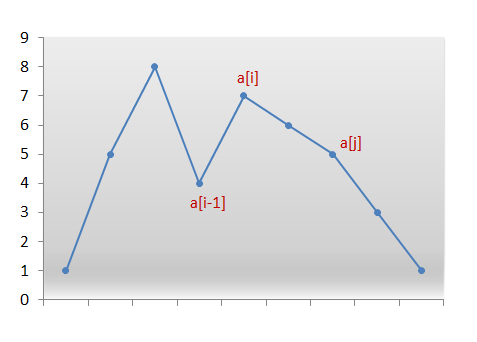
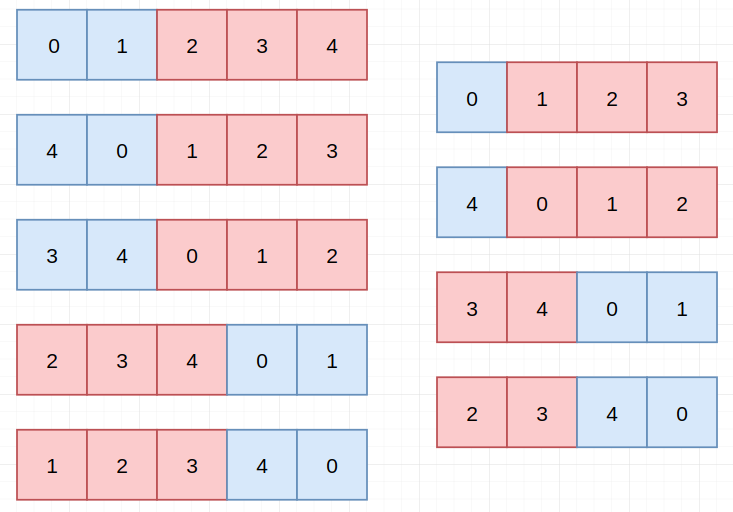
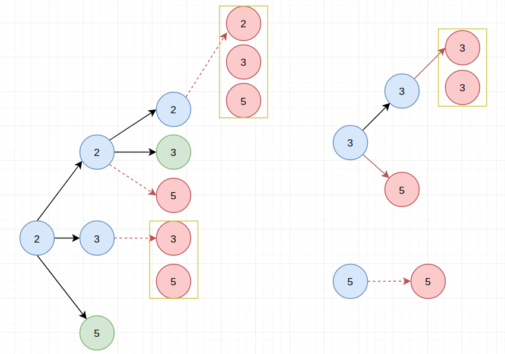
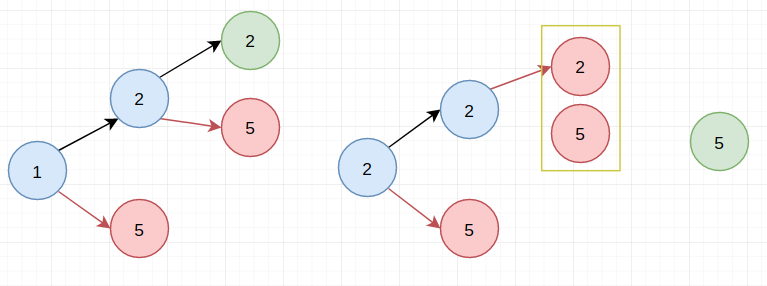

# LeetCode Part4

> 每天小刷几题，提神醒脑～

## 31. 下一个排列

> 实现获取下一个排列的函数，算法需要将给定数字序列重新排列成字典序中下一个更大的排列。
>
> 如果不存在下一个更大的排列，则将数字重新排列成最小的排列（即升序排列）。
>
> 必须**原地**修改，只允许使用额外常数空间。
>
> 以下是一些例子，输入位于左侧列，其相应输出位于右侧列。
> `1,2,3` → `1,3,2`
> `3,2,1` → `1,2,3`
> `1,1,5` → `1,5,1`

【解题思路】

> 相关话题：数组

首先，我们观察到对于任何给定序列的降序，没有可能的下一个更大的排列。

例如，以下数组不可能有下一个排列：`[9, 5, 4, 3, 1]`

我们需要从右边找到第一对两个连续的数字 $a[i]$ 和 $a[i-1]$，它们满足 $a[i] > a[i-1]$。现在，没有对 $a[i-1]$右侧的重新排列可以创建更大的排列，因为该子数组由数字按降序组成。因此，我们需要重新排列 $a[i-1]$ 右边的数字，包括它自己。

现在，什么样的重新排列将产生下一个更大的数字？我们想要创建比当前更大的排列。因此，我们需要将数字 $a[i-1]$ 替换为位于其右侧区域的数字中比它更大的数字，例如 $a[j]$。



我们交换数字 $a[i-1]$ 和 $a[j]$。我们现在在索引 $i-1$ 处有正确的数字。 但目前的排列仍然不是我们正在寻找的排列。我们需要通过仅使用 $a[i-1]$ 右边的数字来形成最小的排列。 因此，我们需要放置那些按升序排列的数字，以获得最小的排列。

但是，请记住，在从右侧扫描数字时，我们只是继续递减索引直到我们找到 $a[i]$ 和 $a[i-1]$ 这对数。其中，$a[i]> a[i-1]$。因此，$a[i-1]$ 右边的所有数字都已按降序排序。此外，交换 $a[i-1]$ 和 $a[j]$ 并未改变该顺序。因此，我们只需要反转 $a[i-1]$ 之后的数字，以获得下一个最小的字典排列。

下面的动画将有助于你理解：


时间复杂度：$O(n)$，  空间复杂度：$O(1)$

【代码实现】

```cpp
void nextPermutation(vector<int> &nums) {
    int first = nums.size() - 2;
    while (first >= 0 && nums[first] >= nums[first + 1]) {
        --first;
    }
    if (first == -1) {
        reverse(nums.begin(), nums.end());
        return;
    }
    int tmp = nums[first], second = nums.size() - 1;
    while (second >= 0 && nums[second] <= tmp)
        --second;
    if (second >= 0) swap(nums[first], nums[second]);
    reverse(nums.begin() + first + 1, nums.end());
}
```

## 32. 最长有效括号

> 给定一个只包含 `'('` 和 `')'` 的字符串，找出最长的包含有效括号的子串的长度。
>
> **示例 1:**
>
> ```
> 输入: "(()"
> 输出: 2
> 解释: 最长有效括号子串为 "()"
> ```
>
> **示例 2:**
>
> ```
> 输入: ")()())"
> 输出: 4
> 解释: 最长有效括号子串为 "()()"
> ```


## 33. 搜索旋转排序数组

> 假设按照升序排序的数组在预先未知的某个点上进行了旋转。
>
> ( 例如，数组 `[0,1,2,4,5,6,7]` 可能变为 `[4,5,6,7,0,1,2]` )。
>
> 搜索一个给定的目标值，如果数组中存在这个目标值，则返回它的索引，否则返回 `-1` 。
>
> 你可以假设数组中不存在重复的元素。
>
> 你的算法时间复杂度必须是 *O*(log *n*) 级别。
>
> **示例 1:**
>
> ```
> 输入: nums = [4,5,6,7,0,1,2], target = 0
> 输出: 4
> ```
>
> **示例 2:**
>
> ```
> 输入: nums = [4,5,6,7,0,1,2], target = 3
> 输出: -1
> ```

【解题思路】

> 相关话题：数组，二分查找

主要要观察到一个结论：



1. 当中间的数小于最右边的时候：右半边有序
2. 当中间的数小于最右边的时候：左半边有序

我们可以利用这个性质：每次只需检查是否在有序的半边范围内，即可确定target在哪半边（因为有序的半边最大最小我们可以直接知道）

时间复杂度：$O(logn)$，  空间复杂度：$O(1)$

【代码实现】

```cpp
int search(vector<int> &nums, int target) {
    int i = 0, j = nums.size() - 1;
    while (i <= j) {
        auto mid = (i + j) / 2;
        if (target == nums[mid]) return mid;
        if (nums[mid] > nums[j]) {
            if (target > nums[mid] || target < nums[i]) i = mid + 1;
            else j = mid - 1;
        } else {
            if (target < nums[mid] || target > nums[j]) j = mid - 1;
            else i = mid + 1;
        }
    }
    return -1;
}
```

## 34. 在排序数组中查找元素的第一个和最后一个位置

> 给定一个按照升序排列的整数数组 `nums`，和一个目标值 `target`。找出给定目标值在数组中的开始位置和结束位置。
>
> 你的算法时间复杂度必须是 *O*(log *n*) 级别。
>
> 如果数组中不存在目标值，返回 `[-1, -1]`。
>
> **示例 1:**
>
> ```
> 输入: nums = [5,7,7,8,8,10], target = 8
> 输出: [3,4]
> ```
>
> **示例 2:**
>
> ```
> 输入: nums = [5,7,7,8,8,10], target = 6
> 输出: [-1,-1]
> ```

【解题思路】

> 相关话题：数组，二分查找

可以"写"一个能够返回最左边target和最右边target的二分查找函数（只要在常规的二分查找上面加上下面约束）：

- 利用res来记录找到的位置，利用flag来表示获得最左边还是最右边（flag=true为左，flag=false为右）

- 将`target==nums[mid]`里面的语句改为下面即可：

  ```cpp
  res = mid;
  if (flag) j = mid - 1;
  else i = mid + 1;
  ```

有了上述辅助函数，整个思想就很明确了：

step1：寻找左边下标 left，如果找不到直接返回`-1,-1`，找到则进入step2

step2：如果找到，则寻找`[left, end]`内寻找右边下标right

【代码实现】

```cpp
int binary_search(vector<int> &nums, int i, int j, int target, bool flag) {
    int res = -1, mid;
    while (i <= j) {
        mid = (i + j) / 2;
        if (target == nums[mid]) {
            res = mid;
            if (flag) j = mid - 1;
            else i = mid + 1;
        } else if (target < nums[mid]) j = mid - 1;
        else i = mid + 1;
    }
    return res;
}


vector<int> searchRange(vector<int> &nums, int target) {
    auto left = binary_search(nums, 0, nums.size() - 1, target, true);
    if (left == -1) return {-1, -1};
    auto right = binary_search(nums, left, nums.size() - 1, target, false);
    return {left, right};
}
```

## 35. 搜索插入位置

> 给定一个排序数组和一个目标值，在数组中找到目标值，并返回其索引。如果目标值不存在于数组中，返回它将会被按顺序插入的位置。
>
> 你可以假设数组中无重复元素。
>
> **示例 1:**
>
> ```
> 输入: [1,3,5,6], 5
> 输出: 2
> ```
>
> **示例 2:**
>
> ```
> 输入: [1,3,5,6], 2
> 输出: 1
> ```
>
> **示例 3:**
>
> ```
> 输入: [1,3,5,6], 7
> 输出: 4
> ```
>
> **示例 4:**
>
> ```
> 输入: [1,3,5,6], 0
> 输出: 0
> ```

【解题思路】

> 相关话题：数组，二分查找

普通的二分查找而言，只是返回left即可（下述代码用`i`表示`left`）

【代码实现】

```cpp
int searchInsert(vector<int> &nums, int target) {
    int i = 0, j = nums.size() - 1;
    while (i <= j) {
        int mid = (i + j) / 2;
        if (nums[mid] == target) return mid;
        else if (nums[mid] < target) i = mid + 1;
        else j = mid - 1;
    }
    return i;
}
```

## 36. 有效的数独

> 判断一个 9x9 的数独是否有效。只需要**根据以下规则**，验证已经填入的数字是否有效即可。
>
> 1. 数字 `1-9` 在每一行只能出现一次。
> 2. 数字 `1-9` 在每一列只能出现一次。
> 3. 数字 `1-9` 在每一个以粗实线分隔的 `3x3` 宫内只能出现一次。
>
> 
>
> 上图是一个部分填充的有效的数独。
>
> 数独部分空格内已填入了数字，空白格用 `'.'` 表示。
>
> **示例 1:**
>
> ```
> 输入:
> [
>   ["5","3",".",".","7",".",".",".","."],
>   ["6",".",".","1","9","5",".",".","."],
>   [".","9","8",".",".",".",".","6","."],
>   ["8",".",".",".","6",".",".",".","3"],
>   ["4",".",".","8",".","3",".",".","1"],
>   ["7",".",".",".","2",".",".",".","6"],
>   [".","6",".",".",".",".","2","8","."],
>   [".",".",".","4","1","9",".",".","5"],
>   [".",".",".",".","8",".",".","7","9"]
> ]
> 输出: true
> ```
>
> **示例 2:**
>
> ```
> 输入:
> [
>   ["8","3",".",".","7",".",".",".","."],
>   ["6",".",".","1","9","5",".",".","."],
>   [".","9","8",".",".",".",".","6","."],
>   ["8",".",".",".","6",".",".",".","3"],
>   ["4",".",".","8",".","3",".",".","1"],
>   ["7",".",".",".","2",".",".",".","6"],
>   [".","6",".",".",".",".","2","8","."],
>   [".",".",".","4","1","9",".",".","5"],
>   [".",".",".",".","8",".",".","7","9"]
> ]
> 输出: false
> 解释: 除了第一行的第一个数字从 5 改为 8 以外，空格内其他数字均与 示例1 相同。
>      但由于位于左上角的 3x3 宫内有两个 8 存在, 因此这个数独是无效的。
> ```
>
> **说明:**
>
> - 一个有效的数独（部分已被填充）不一定是可解的。
> - 只需要根据以上规则，验证已经填入的数字是否有效即可。
> - 给定数独序列只包含数字 `1-9` 和字符 `'.'` 。
> - 给定数独永远是 `9x9` 形式的。

【解题思路】

> 相关话题：哈希表

可以采用"暴力解法"，分别建立三个容器来存储行，列，宫格内是否满足规则：

- `vector<vector<bool>> rows(n, vector<bool>(9, true));`：记录每行每个数字是否出现过
- `vector<vector<bool>> cols(n, vector<bool>(9, true));`：记录每列每个数字是否出现过
- `vector<vector<bool>> cell(n, vector<bool>(9, true));`：记录每个单元里面每个数字是否出现过

下面就是如何通过`i, j`下标找到对应位置：

- rows：直接通过`i`
- cols：直接通过`j`
- cell：利用`i/3*3+j/3`来定位

当遇到数字时：如果指定位置为true，则转为false；否则直接返回false

时间复杂度：$O(n^2)$，  空间复杂度：$O(9n)$

【代码实现】

```cpp
bool isValidSudoku(vector<vector<char>> &board) {
    int n = board.size();
    vector<vector<bool>> rows(n, vector<bool>(9, true));
    vector<vector<bool>> cols(n, vector<bool>(9, true));
    vector<vector<bool>> cell(n, vector<bool>(9, true));
    for (int i = 0; i < n; ++i) {
        for (int j = 0; j < n; ++j) {
            if (board[i][j] == '.')
                continue;
            char val = board[i][j] - '1';
            if (rows[i][val]) rows[i][val] = false;
            else return false;
            if (cols[j][val]) cols[j][val] = false;
            else return false;
            if (cell[i / 3 * 3 + j / 3][val]) cell[i / 3 * 3 + j / 3][val] = false;
            else return false;
        }
    }
    return true;
}
```

## 37. 解数独

> 编写一个程序，通过已填充的空格来解决数独问题。
>
> 一个数独的解法需**遵循如下规则**：
>
> 1. 数字 `1-9` 在每一行只能出现一次。
> 2. 数字 `1-9` 在每一列只能出现一次。
> 3. 数字 `1-9` 在每一个以粗实线分隔的 `3x3` 宫内只能出现一次。
>
> 空白格用 `'.'` 表示。
>
> 
>
> 一个数独。
>
> 
>
> 答案被标成红色。
>
> **Note:**
>
> - 给定的数独序列只包含数字 `1-9` 和字符 `'.'` 。
> - 你可以假设给定的数独只有唯一解。
> - 给定数独永远是 `9x9` 形式的。


## 38. 报数

> 报数序列是指一个整照其中**的整数的**顺序进数序列，按行报数，得到下一个数。其前五项如下：
>
> ```
> 1.     1
> 2.     11
> 3.     21
> 4.     1211
> 5.     111221
> ```
>
> `1` 被读作  `"one 1"`  (`"一个一"`) , 即 `11`。
> `11` 被读作 `"two 1s"` (`"两个一"`）, 即 `21`。
> `21` 被读作 `"one 2"`,  "`one 1"` （`"一个二"` ,  `"一个一"`) , 即 `1211`。
>
> 给定一个正整数 *n*（1 ≤ *n* ≤ 30），输出报数序列的第 *n* 项。
>
> 注意：整数顺序将表示为一个字符串。
>
> **示例 1:**
>
> ```
> 输入: 1
> 输出: "1"
> ```
>
> **示例 2:**
>
> ```
> 输入: 4
> 输出: "1211"
> ```

【解题思路】

> 相关话题：字符串

没什么特别的技巧，就是"读"字符串；一遍遍历，相同字母不断前进并记录有几个。

【代码实现】

```cpp
string countAndSay(int n) {
    string res = "1";
    for (int i = 2; i <= n; ++i) {
        string tmp;
        int l = res.length();
        for (int j = 0; j < l;) {
            char a = res[j];
            int cnt = 1;
            while (j + 1 < l && res[j] == res[j + 1]) { ++cnt, ++j; }
            tmp.push_back(cnt + '0');
            tmp.push_back(a);
            ++j;
        }
        res = tmp;
    }
    return res;
}
```

## 39. 组合总和

> 给定一个**无重复元素**的数组 `candidates` 和一个目标数 `target` ，找出 `candidates` 中所有可以使数字和为 `target` 的组合。
>
> `candidates` 中的数字可以无限制重复被选取。
>
> **说明：**
>
> - 所有数字（包括 `target`）都是正整数。
> - 解集不能包含重复的组合。 
>
> **示例 1:**
>
> ```
> 输入: candidates = [2,3,6,7], target = 7,
> 所求解集为:
> [
>   [7],
>   [2,2,3]
> ]
> ```
>
> **示例 2:**
>
> ```
> 输入: candidates = [2,3,5], target = 8,
> 所求解集为:
> [
>   [2,2,2,2],
>   [2,3,3],
>   [3,5]
> ]
> ```

【解题思路】

> 相关话题：数组，回溯算法

这道题目的本质是深度优先搜索的变种。

step1：先对candidates进行排序（主要为了加快后续的搜索）

step2：按照深度优先搜索进行搜索（以`[2, 3, 5]`，`target=7`为例，搜索的方式如下图所示）



说下规则：（其中红色代表sum>target情况，绿色代表sum=target情况）

1. 后一个结点的遍历等于前一个结点及其后续的全部结点（但不包括之前的结点）
2. 当"sum>target"时，直接放弃遍历该结点后续结点（这步主要由于排序后带来的遍历，否则还需遍历全部结点）

时间复杂度：$O(n!)$， 空间复杂度：$O(target/min(array))$（如果不包括返回的数组）

【代码实现】

```cpp
void helper(vector<int> &array, int level, int target, vector<int> &tmp, vector<vector<int>> &res) {
    for (int i = level; i < array.size(); ++i) {
        target -= array[i];
        if (target < 0) return;
        else if (target == 0) {
            tmp.push_back(array[i]);
            res.push_back(tmp);
            tmp.pop_back();
            return;
        } else {
            tmp.push_back(array[i]);
            helper(array, i, target, tmp, res);
            target += array[i];
            tmp.pop_back();
        }
    }
}

vector<vector<int>> combinationSum(vector<int> &candidates, int target) {
    sort(candidates.begin(), candidates.end());
    vector<vector<int>> res;
    vector<int> tmp;
    helper(candidates, 0, target, tmp, res);
    return res;
}
```

## 40. 组合总和 II

> 给定一个数组 `candidates` 和一个目标数 `target` ，找出 `candidates` 中所有可以使数字和为 `target` 的组合。
>
> `candidates` 中的每个数字在每个组合中只能使用一次。
>
> **说明：**
>
> - 所有数字（包括目标数）都是正整数。
> - 解集不能包含重复的组合。 
>
> **示例 1:**
>
> ```
> 输入: candidates = [10,1,2,7,6,1,5], target = 8,
> 所求解集为:
> [
>   [1, 7],
>   [1, 2, 5],
>   [2, 6],
>   [1, 1, 6]
> ]
> ```
>
> **示例 2:**
>
> ```
> 输入: candidates = [2,5,2,1,2], target = 5,
> 所求解集为:
> [
>   [1,2,2],
>   [5]
> ]
> ```

【解题思路】

> 相关话题：数组，回溯算法

还是深度优先搜索的变种。

step1：先对数组排序（不然处理重复的vector会非常麻烦）

step2：采用深度优先搜索进行搜索（如下图所示的方式---以`1,2,2,2,5`为例）



说下几条规则：

1. 遍历为前一个结点后面所有结点，且每次遇到`nums[i]==nums[i-1]`的时候，自动跳过去（为了避免重复）
2. 遇到"溢出"直接终止此处寻找

时间复杂度：$O(n)$

【代码实现】

```cpp
void helper(vector<int> &array, int level, int target, vector<int> &tmp, vector<vector<int>> &res) {
    if (target < 0) return;
    if (target == 0) res.push_back(tmp);
    else {
        for (int i = level; i < array.size(); ++i) {
            if (i > level && array[i] == array[i - 1]) continue;
            tmp.push_back(array[i]);
            helper(array, i + 1, target - array[i], tmp, res);
            tmp.pop_back();
        }
    }
}

vector<vector<int>> combinationSum2(vector<int> &candidates, int target) {
    sort(candidates.begin(), candidates.end());
    vector<vector<int>> res;
    vector<int> tmp;
    helper(candidates, 0, target, tmp, res);
    return res;
}
```

