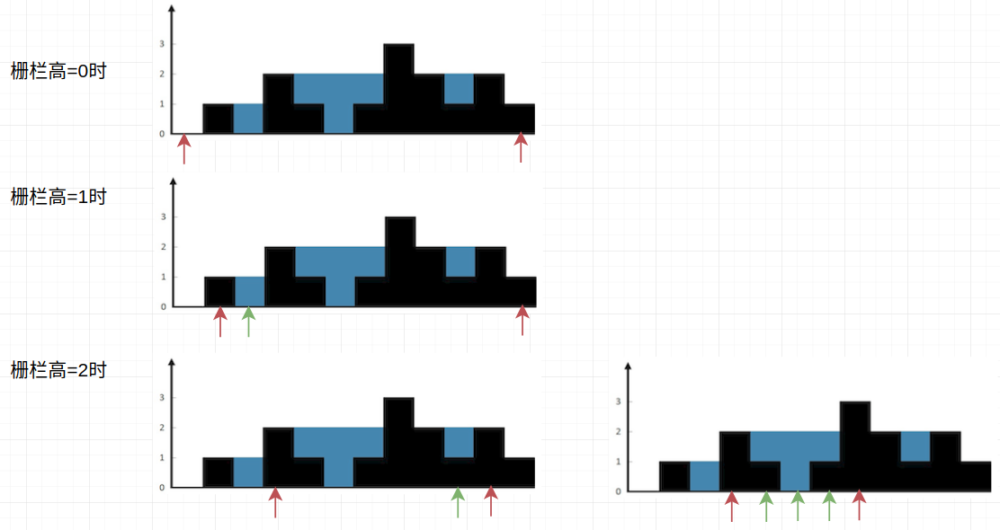
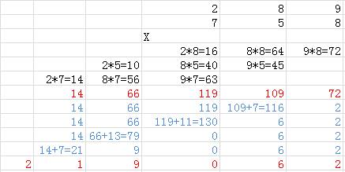
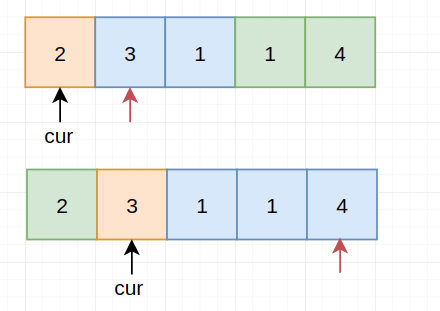

# LeetCode Part5

> 每天小刷几题，提神醒脑～

## 41. 缺失的第一个正数

> 给定一个未排序的整数数组，找出其中没有出现的最小的正整数。
>
> **示例 1:**
>
> ```
> 输入: [1,2,0]
> 输出: 3
> ```
>
> **示例 2:**
>
> ```
> 输入: [3,4,-1,1]
> 输出: 2
> ```
>
> **示例 3:**
>
> ```
> 输入: [7,8,9,11,12]
> 输出: 1
> ```
>
> **说明:**
>
> 你的算法的时间复杂度应为O(*n*)，并且只能使用常数级别的空间。

【解题思路】

> 相关话题：数组

step1：将`nums[i]`放到`nums[nums[i]-1]`的位置上去，一个简单的实例如下所示：


主要遵从一个原则：

1. 当`nums[i]>=1 and nums[i]<=n && and nums[nums[i-1]]!=nums[i]`时进行替换，并将其保存到原来位置

step2：再遍历一遍，如果`nums[i]!=i+1`则直接返回`i+1`

时间复杂度：$O(n)$，  空间复杂度：$O(1)$

【代码实现】

```cpp
int firstMissingPositive(vector<int> &nums) {
    int n = nums.size(), tmp;
    for (int i = 0; i < n; ++i) {
        tmp = nums[i];
        while (tmp >= 1 && tmp <= n && tmp != nums[tmp - 1]) {
            auto t = nums[tmp - 1];
            nums[tmp - 1] = tmp;
            tmp = t;
        }
    }
    for (int i = 0; i < n; ++i) {
        if (nums[i] != i + 1) return i + 1;
    }
    return n + 1;
}
```

## 42. 接雨水

> 给定 *n* 个非负整数表示每个宽度为 1 的柱子的高度图，计算按此排列的柱子，下雨之后能接多少雨水。
>
> 
>
> 上面是由数组 [0,1,0,2,1,0,1,3,2,1,2,1] 表示的高度图，在这种情况下，可以接 6 个单位的雨水（蓝色部分表示雨水）。 **感谢 Marcos** 贡献此图。
>
> **示例:**
>
> ```
> 输入: [0,1,0,2,1,0,1,3,2,1,2,1]
> 输出: 6
> ```

【解题思路】

> 相关话题：栈，数组，双指针

#### 方法1：动态规划

维护一个dp数组，这个DP算法需要遍历两遍数组，第一遍遍历dp[i]中存入i位置左边的最大值，然后开始第二遍遍历数组，第二次遍历时找右边最大值，然后和左边最大值比较取其中的较小值，然后跟当前值A[i]相比，如果大于当前值，则将差值存入结果。（相当于我们每次只管自己这个位置的储水）

#### 方法2：双指针

采用left和right两个指针分别指向数组的首尾位置，从两边向中间扫描，在当前两指针确定的范围内，先比较两头找出较小值，如果较小值是left指向的值，则从左向右扫描，如果较小值是right指向的值，则从右向左扫描，若遇到的值比当较小值小，则将差值存入结果，如遇到的值大，则重新确定新的窗口范围，以此类推直至left和right指针重合

（其实思想非常类似两边"栅栏"先围住，当遇到某边有更高的"栅栏"时，更换成更高的）



#### 方法3： 栈

遍历高度，如果此时栈为空，或者当前高度小于等于栈顶高度，则把当前高度的坐标压入栈，注意我们不直接把高度压入栈，而是把坐标压入栈，这样方便我们在后来算水平距离。当我们遇到比栈顶高度大的时候，就说明有可能会有坑存在，可以装雨水。此时我们栈里至少有一个高度，如果只有一个的话，那么不能形成坑，我们直接跳过，如果多余一个的话，那么此时把栈顶元素取出来当作坑，新的栈顶元素就是左边界，当前高度是右边界，只要取二者较小的，减去坑的高度，长度就是右边界坐标减去左边界坐标再减1，二者相乘就是盛水量啦。

（栈内部的特点就是始终保证下面的比上面的对应的height要高或等于）

【代码实现】

#### 方法1

```cpp
int trap(vector<int> &height) {
    int n = height.size(), res = 0;
    vector<int> dp(n, 0);
    for (int i = 1; i < n; ++i) {
        dp[i] = max(dp[i - 1], height[i - 1]);
    }
    if (n > 1) dp[n - 1] = 0;
    for (int i = n - 2; i > 0; --i) {
        auto left = dp[i];
        dp[i] = max(dp[i + 1], height[i + 1]);
        if (min(dp[i], left) > height[i]) res += (min(dp[i], left) - height[i]);
    }
    return res;
}
```

#### 方法2

```cpp
int trap2(vector<int> &height) {
    int res = 0, l = 0, r = height.size() - 1;
    while (l < r) {
        int mn = min(height[l], height[r]);
        if (mn == height[l]) {
            ++l;
            while (l < r && height[l] < mn) {
                res += mn - height[l++];
            }
        } else {
            --r;
            while (l < r && height[r] < mn) {
                res += mn - height[r--];
            }
        }
    }
    return res;
}
```

#### 方法3

```cpp
int trap3(vector<int> &height) {
    stack<int> st;
    int i = 0, res = 0, n = height.size();
    while (i < n) {
        if (st.empty() || height[i] <= height[st.top()]) {
            st.push(i++);
        } else {
            int t = st.top();
            st.pop();
            if (st.empty()) continue;
            res += (min(height[i], height[st.top()]) - height[t]) * (i - st.top() - 1);
        }
    }
    return res;
}
```

## 43. 字符串相乘

> 给定两个以字符串形式表示的非负整数 `num1` 和 `num2`，返回 `num1` 和 `num2` 的乘积，它们的乘积也表示为字符串形式。
>
> **示例 1:**
>
> ```
> 输入: num1 = "2", num2 = "3"
> 输出: "6"
> ```
>
> **示例 2:**
>
> ```
> 输入: num1 = "123", num2 = "456"
> 输出: "56088"
> ```
>
> **说明：**
>
> 1. `num1` 和 `num2` 的长度小于110。
> 2. `num1` 和 `num2` 只包含数字 `0-9`。
> 3. `num1` 和 `num2` 均不以零开头，除非是数字 0 本身。
> 4. **不能使用任何标准库的大数类型（比如 BigInteger）**或**直接将输入转换为整数来处理**。

【解题思路】

> 相关话题：数学，字符串

采用下图所示的情况进行即可（小学时候的乘法方式）：



有几点需注意：

1. n位数xm位数的结果最多为m+n位数（比如2位数x3位数<$100\times 1000=10^5$，所以最大5位数）

【代码实现】

```cpp
string multiply(string num1, string num2) {
    string res;
    int n1 = num1.size(), n2 = num2.size();
    int k = n1 + n2 - 2, carry = 0;
    vector<int> v(n1 + n2, 0);
    for (int i = 0; i < n1; ++i) {
        for (int j = 0; j < n2; ++j) {
            v[k - i - j] += (num1[i] - '0') * (num2[j] - '0');
        }
    }
    for (int i = 0; i < n1 + n2; ++i) {
        v[i] += carry;
        carry = v[i] / 10;
        v[i] %= 10;
    }
    int i = n1 + n2 - 1;
    while (v[i] == 0) --i;
    if (i < 0) return "0";
    while (i >= 0) res.push_back(v[i--] + '0');
    return res;
}
```

## 44. 通配符匹配

> 给定一个字符串 (`s`) 和一个字符模式 (`p`) ，实现一个支持 `'?'` 和 `'*'` 的通配符匹配。
>
> ```
> '?' 可以匹配任何单个字符。
> '*' 可以匹配任意字符串（包括空字符串）。
> ```
>
> 两个字符串**完全匹配**才算匹配成功。
>
> **说明:**
>
> - `s` 可能为空，且只包含从 `a-z` 的小写字母。
> - `p` 可能为空，且只包含从 `a-z` 的小写字母，以及字符 `?` 和 `*`。
>
> **示例 1:**
>
> ```
> 输入:
> s = "aa"
> p = "a"
> 输出: false
> 解释: "a" 无法匹配 "aa" 整个字符串。
> ```
>
> **示例 2:**
>
> ```
> 输入:
> s = "aa"
> p = "*"
> 输出: true
> 解释: '*' 可以匹配任意字符串。
> ```
>
> **示例 3:**
>
> ```
> 输入:
> s = "cb"
> p = "?a"
> 输出: false
> 解释: '?' 可以匹配 'c', 但第二个 'a' 无法匹配 'b'。
> ```
>
> **示例 4:**
>
> ```
> 输入:
> s = "adceb"
> p = "*a*b"
> 输出: true
> 解释: 第一个 '*' 可以匹配空字符串, 第二个 '*' 可以匹配字符串 "dce".
> ```
>
> **示例 5:**
>
> ```
> 输入:
> s = "acdcb"
> p = "a*c?b"
> 输入: false
> ```

【解题思路】


## 45. 跳跃游戏 II

> 给定一个非负整数数组，你最初位于数组的第一个位置。
>
> 数组中的每个元素代表你在该位置可以跳跃的最大长度。
>
> 你的目标是使用最少的跳跃次数到达数组的最后一个位置。
>
> **示例:**
>
> ```
> 输入: [2,3,1,1,4]
> 输出: 2
> 解释: 跳到最后一个位置的最小跳跃数是 2。
>      从下标为 0 跳到下标为 1 的位置，跳 1 步，然后跳 3 步到达数组的最后一个位置。
> ```
>
> **说明:**
>
> 假设你总是可以到达数组的最后一个位置。

【解题思路】

> 相关话题：贪心算法，数组

每次当前围住`cur`下一步能走到的所有位置`next`中"再走一步"最远的位置，将该`cur`更新为此`next`，不断进行下去直到`cur`能够直接一步走到最后一个位置



【代码实现】

```cpp
int jump(vector<int> &nums) {
    int n = nums.size();
    int cur = 0, next = 0, pos, res = 0;
    while (cur < n - 1) {
        if (cur + nums[cur] >= n - 1) return res + 1;
        for (int i = 1; i <= nums[cur]; ++i) {
            if (cur + i + nums[cur + i] > next) {
                next = cur + i + nums[cur + i];
                pos = cur + i;
            }
        }
        cur = pos;
        ++res;
    }
    return res;
}
```

