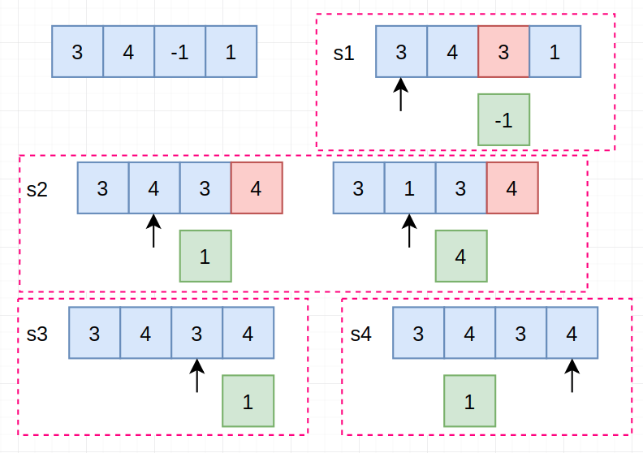

# LeetCode Part5

> 每天小刷几题，提神醒脑～

## 41. 缺失的第一个正数

> 给定一个未排序的整数数组，找出其中没有出现的最小的正整数。
>
> **示例 1:**
>
> ```
> 输入: [1,2,0]
> 输出: 3
> ```
>
> **示例 2:**
>
> ```
> 输入: [3,4,-1,1]
> 输出: 2
> ```
>
> **示例 3:**
>
> ```
> 输入: [7,8,9,11,12]
> 输出: 1
> ```
>
> **说明:**
>
> 你的算法的时间复杂度应为O(*n*)，并且只能使用常数级别的空间。

【解题思路】

> 相关话题：数组

step1：将`nums[i]`放到`nums[nums[i]-1]`的位置上去，一个简单的实例如下所示：



主要遵从一个原则：

1. 当`nums[i]>=1 and nums[i]<=n && and nums[nums[i-1]]!=nums[i]`时进行替换，并将其保存到原来位置

step2：再遍历一遍，如果`nums[i]!=i+1`则直接返回`i+1`

时间复杂度：$O(n)$，  空间复杂度：$O(1)$

【代码实现】

```cpp
int firstMissingPositive(vector<int> &nums) {
    int n = nums.size(), tmp;
    for (int i = 0; i < n; ++i) {
        tmp = nums[i];
        while (tmp >= 1 && tmp <= n && tmp != nums[tmp - 1]) {
            auto t = nums[tmp - 1];
            nums[tmp - 1] = tmp;
            tmp = t;
        }
    }
    for (int i = 0; i < n; ++i) {
        if (nums[i] != i + 1) return i + 1;
    }
    return n + 1;
}
```

## 42. 接雨水

> 给定 *n* 个非负整数表示每个宽度为 1 的柱子的高度图，计算按此排列的柱子，下雨之后能接多少雨水。
>
> 
>
> 上面是由数组 [0,1,0,2,1,0,1,3,2,1,2,1] 表示的高度图，在这种情况下，可以接 6 个单位的雨水（蓝色部分表示雨水）。 **感谢 Marcos** 贡献此图。
>
> **示例:**
>
> ```
> 输入: [0,1,0,2,1,0,1,3,2,1,2,1]
> 输出: 6
> ```

【解题思路】

> 相关话题：栈，数组，双指针


## 43. 字符串相乘

> 给定两个以字符串形式表示的非负整数 `num1` 和 `num2`，返回 `num1` 和 `num2` 的乘积，它们的乘积也表示为字符串形式。
>
> **示例 1:**
>
> ```
> 输入: num1 = "2", num2 = "3"
> 输出: "6"
> ```
>
> **示例 2:**
>
> ```
> 输入: num1 = "123", num2 = "456"
> 输出: "56088"
> ```
>
> **说明：**
>
> 1. `num1` 和 `num2` 的长度小于110。
> 2. `num1` 和 `num2` 只包含数字 `0-9`。
> 3. `num1` 和 `num2` 均不以零开头，除非是数字 0 本身。
> 4. **不能使用任何标准库的大数类型（比如 BigInteger）**或**直接将输入转换为整数来处理**。

【解题思路】

> 相关话题：数学，字符串

#### 方法1：动态规划

