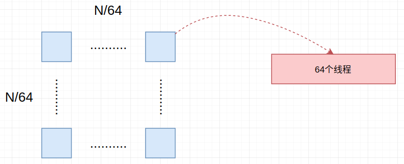

# C++扩展

采用`setuptools`将扩展打包（下面是模板---来自：[mask-rcnn](https://github.com/facebookresearch/maskrcnn-benchmark/blob/master/setup.py)）

```python
import glob
import os

import torch
from setuptools import setup
from torch.utils.cpp_extension import CUDA_HOME
from torch.utils.cpp_extension import CppExtension
from torch.utils.cpp_extension import CUDAExtension

requirements = ["torch", "torchvision"]

# 核心部分：指定需要打包的内容
def get_extensions():
    this_dir = os.path.dirname(os.path.abspath(__file__))  # 当前路径
    extensions_dir = os.path.join(this_dir, "xxx")         # 需要扩展文件夹路径

    main_file = glob.glob(os.path.join(extensions_dir, "*.cpp"))  # PYBIND11_MODULE文件
    source_cpu = glob.glob(os.path.join(extensions_dir, "cpu", "*.cpp")) # cpu文件
    source_cuda = glob.glob(os.path.join(extensions_dir, "cuda", "*.cu")) # gpu文件

    sources = main_file + source_cpu
    extension = CppExtension

    extra_compile_args = {"cxx": []}
    define_macros = []

    if torch.cuda.is_available() and CUDA_HOME is not None:
        extension = CUDAExtension
        sources += source_cuda
        define_macros += [("WITH_CUDA", None)]
        extra_compile_args["nvcc"] = [
            "-DCUDA_HAS_FP16=1",
            "-D__CUDA_NO_HALF_OPERATORS__",
            "-D__CUDA_NO_HALF_CONVERSIONS__",
            "-D__CUDA_NO_HALF2_OPERATORS__",
        ]

    sources = [os.path.join(extensions_dir, s) for s in sources]

    include_dirs = [extensions_dir]

    ext_modules = [
        extension(
            "maskrcnn_benchmark._C",
            sources,
            include_dirs=include_dirs,
            define_macros=define_macros,
            extra_compile_args=extra_compile_args,
        )
    ]

    return ext_modules


setup(
    name="名字",
    version="版本号",
    author="作者名",
    url="链接：通常为你这个项目的github",
    description="扩展包的简单描述",
    # packages=find_packages(exclude=("configs", "examples", "test",)),
    # install_requires=requirements,
    ext_modules=get_extensions(),   # 扩展模块 --- 这个是核心
    cmdclass={"build_ext": torch.utils.cpp_extension.BuildExtension},  # 这部分照抄就好---pytorch帮我们写好了build_ext
)
```

下面两个具体例子来看下底层的C++应该怎么写。

### ① Demo1：nms_cpu（没有写反向传播过程）

文件结构如下所示：

```shell
-- vision.cpp  # Extension"的接口": PYBIND11_MODULE
-- nms.h
-- cpu
   -- vision.h
   -- nms_cpu.cpp
-- cuda
   -- vision.h
   -- nms.cu
```

1. `vision.cpp`

   ```cpp
   #include "nms.h"

   PYBIND11_MODULE(TORCH_EXTENSION_NAME, m) {
     m.def("nms", &nms, "non-maximum suppression");
   }
   ```

   > 关于PYBIND11_MODULE请参考：[pybind11](https://pybind11.readthedocs.io/en/stable/upgrade.html) --- 其实直接套用大多数情况是没问题的

2. `nms.h`

   ```cpp
   #pragma once   // 为了避免同一个文件被include多次
   #include "cpu/vision.h"  

   #ifdef WITH_CUDA
   #include "cuda/vision.h"
   #endif

   at::Tensor nms(const at::Tensor& dets,
                  const at::Tensor& scores,
                  const float threshold) {

     if (dets.type().is_cuda()) {
   #ifdef WITH_CUDA
       // TODO raise error if not compiled with CUDA
       if (dets.numel() == 0)
         return at::empty({0}, dets.options().dtype(at::kLong).device(at::kCPU));
       auto b = at::cat({dets, scores.unsqueeze(1)}, 1);
       return nms_cuda(b, threshold);
   #else
       AT_ERROR("Not compiled with GPU support");
   #endif
     }
   
     at::Tensor result = nms_cpu(dets, scores, threshold);
     return result;
   }
   ```

3. `cpu/vision.h`

   ```cpp
   #pragma once
   #include <torch/extension.h>

   at::Tensor nms_cpu(const at::Tensor& dets,
                      const at::Tensor& scores,
                      const float threshold);
   ```

4. `cpu/nms_cpu.cpp`

   ```cpp
   #include "cpu/vision.h"

   template <typename scalar_t>
   at::Tensor nms_cpu_kernel(const at::Tensor& dets,    // Nx4
                             const at::Tensor& scores,  // Nx1
                             const float threshold) {   
     AT_ASSERTM(!dets.type().is_cuda(), "dets must be a CPU tensor");
     AT_ASSERTM(!scores.type().is_cuda(), "scores must be a CPU tensor");
     AT_ASSERTM(dets.type() == scores.type(), "dets should have the same type as scores");

     if (dets.numel() == 0) {
       return at::empty({0}, dets.options().dtype(at::kLong).device(at::kCPU));
     }

     auto x1_t = dets.select(1, 0).contiguous();  // select(dim, index)
     auto y1_t = dets.select(1, 1).contiguous();
     auto x2_t = dets.select(1, 2).contiguous();
     auto y2_t = dets.select(1, 3).contiguous();

     at::Tensor areas_t = (x2_t - x1_t + 1) * (y2_t - y1_t + 1);

     auto order_t = std::get<1>(scores.sort(0, /* descending=*/true));  // sort(dim, descending=False) -> (Tensor, LongTensor)

     auto ndets = dets.size(0);
     at::Tensor suppressed_t = at::zeros({ndets}, dets.options().dtype(at::kByte).device(at::kCPU));

     auto suppressed = suppressed_t.data<uint8_t>();
     auto order = order_t.data<int64_t>();
     auto x1 = x1_t.data<scalar_t>();
     auto y1 = y1_t.data<scalar_t>();
     auto x2 = x2_t.data<scalar_t>();
     auto y2 = y2_t.data<scalar_t>();
     auto areas = areas_t.data<scalar_t>();

     for (int64_t _i = 0; _i < ndets; _i++) {
       auto i = order[_i];
       if (suppressed[i] == 1)
         continue;
       auto ix1 = x1[i];
       auto iy1 = y1[i];
       auto ix2 = x2[i];
       auto iy2 = y2[i];
       auto iarea = areas[i];

       for (int64_t _j = _i + 1; _j < ndets; _j++) {
         auto j = order[_j];
         if (suppressed[j] == 1)
           continue;
         auto xx1 = std::max(ix1, x1[j]);
         auto yy1 = std::max(iy1, y1[j]);
         auto xx2 = std::min(ix2, x2[j]);
         auto yy2 = std::min(iy2, y2[j]);

         auto w = std::max(static_cast<scalar_t>(0), xx2 - xx1 + 1);
         auto h = std::max(static_cast<scalar_t>(0), yy2 - yy1 + 1);
         auto inter = w * h;
         auto ovr = inter / (iarea + areas[j] - inter);
         if (ovr >= threshold)
           suppressed[j] = 1;
      }
     }
     return at::nonzero(suppressed_t == 0).squeeze(1);
   }

   at::Tensor nms_cpu(const at::Tensor& dets,
                  const at::Tensor& scores,
                  const float threshold) {
     at::Tensor result;
     AT_DISPATCH_FLOATING_TYPES(dets.type(), "nms", [&] {
       result = nms_cpu_kernel<scalar_t>(dets, scores, threshold);
     });
     return result;
   }
   ```


### ① Demo1：nms_gpu（没有写反向传播过程）



而每个Block"做什么呢"？（针对第i行，第j列的Block），其中的每个线程我们可以"看做行"（那么就能"凑齐"N行了）那么每个线程(idx)计算的是当前位置$64\cdot i+idx$与$[64\cdot j,64\cdot(j+1)$]这64个boxes对应的IoU情况 --- 这里采用一个`unsigned long long`来记录这64个IoU是否超过了给定的阈值（`1<<k`代表第k+1个boxes与当前位置的box重叠率超过阈值）

> 这部分输出是采用一个大小为$N\times (N/64)$的mask_dev来记录：
>
> 
>
> 其中每个$N/64$的块可以看成某个box和其他所有boxes的重叠情况。因为$N/64$中的每个值都代表当前box和64个其他boxes之间的重叠率。

