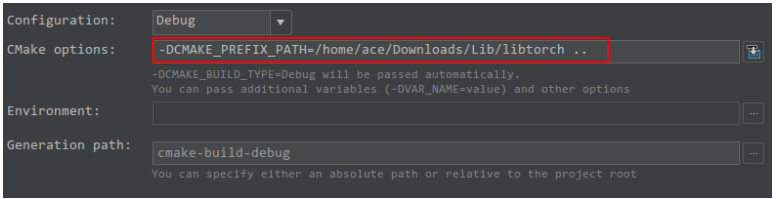
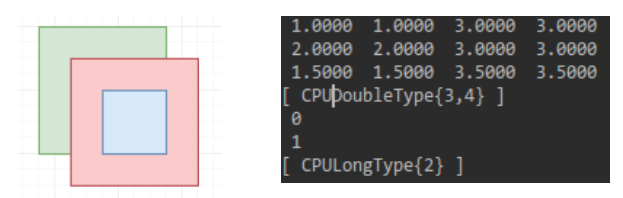

# 如何对PyTorch的C++ Extension进行Deubug

> 下面教程只针对CPU程序（无需打包成Python接口，直接C++环境进行Debug）
>
> 1. 环境CLion
> 2. CMAKE: 3.8，C++14（11及以上）

step1：安装`libtorch`库

```shell
wget https://download.pytorch.org/libtorch/nightly/cpu/libtorch-shared-with-deps-latest.zip
unzip libtorch-shared-with-deps-latest.zip
```

> 详细请参考：[PyTorch cppdocs](https://pytorch.org/cppdocs/installing.html)

step2：设置CLion的CMakeLists.txt环境

```cmake
cmake_minimum_required(VERSION 3.8)
project(nms)

set(CMAKE_CXX_STANDARD 14)

find_package(Torch REQUIRED)
find_package(PythonLibs REQUIRED)
include_directories(${PYTHON_INCLUDE_DIRS})  

set(SOURCE_FILES main.cpp nms_cpu.cpp nms_cpu.h)
add_executable(nms ${SOURCE_FILES})
target_link_libraries(nms "${TORCH_LIBRARIES}")
target_link_libraries(nms "${PYTHON_LIBRARIES}")
```

仅仅上述是会报错的。请在`setting->building,excution,deployment->CMake`下面加上你的`libtorch`库所在的位置：（下面红色位置设置为你自己库的路径）



step3：运行demo（[main](./nms/main.cpp)）

```cpp
#include <torch/torch.h>
#include "nms_cpu.h"
#include <iostream>

using namespace std;

int main() {
    at::Tensor boxes = at::tensor({1.0, 1.0, 3.0, 3.0, 2.0, 2.0, 3.0, 3.0, 1.5, 1.5, 3.5, 3.5}).reshape({3, 4});
    at::Tensor scores = at::tensor({0.99, 0.6, 0.8}).reshape({3, 1});
    float threshold = 0.5;
    std::cout << nms_cpu(boxes, scores, threshold) << std::endl;
}
```

我们得到的结果如下：



最高得分为第一个框框。（且其会抑制第三个框框）。所有最终出来的是最终的框框的下标"0和1"

> 计算面积时：$(x_2-x_1+1)*(y_2-y_1+1);$（关于为什么加1，不太清楚=.=，感觉是为了计算IoU时分母不出现0？）

