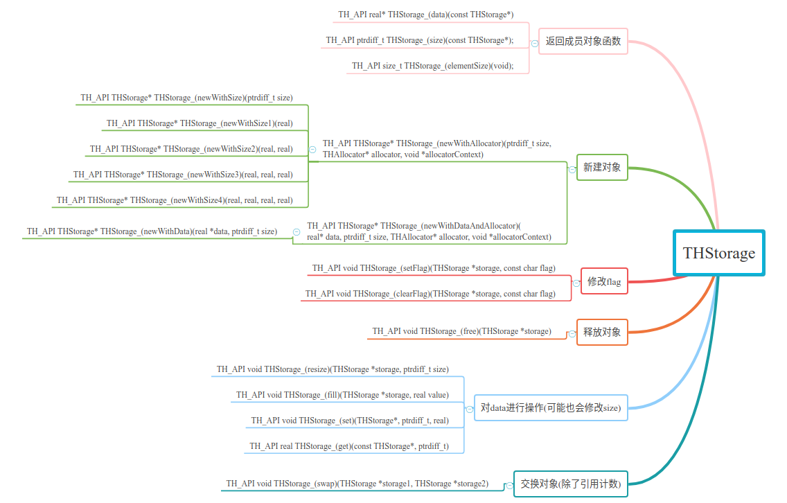
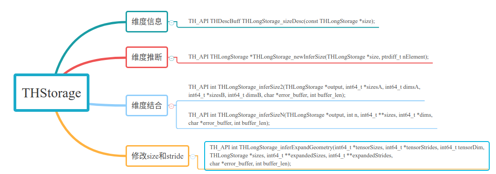
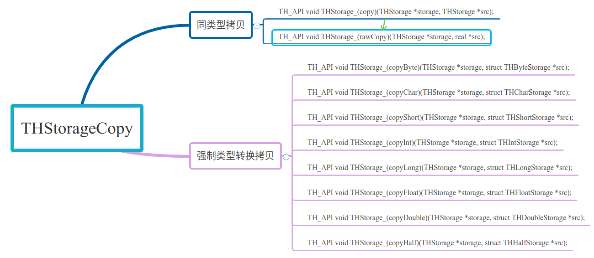

# THStorage

该部分其实是包含两个“同名”的情况（一个在`TH`下面，一个在`TH/generic`下面）

1. `TH/generic`中主要实现的功能：
   - 内存管理函数
   - 新建对象函数
   - 返回storage中元素
   - 辅助函数

2. `TH`中主要实现的功能：
   - 返回维度信息
   - 推断维度

3. `TH/generic/THStorageCopy`主要实现的功能

   - 主要包含复制操作(包括强制类型转换复制)

     > 注：此处的复制是指将data指向空间的元素逐个复制（对data的深度拷贝）

storage结构（在`TH/generic`中）：

```cpp
// 默认0111 --- 即除了view, 其他都是1
#define TH_STORAGE_REFCOUNTED 1  // 是否允许引用计数
#define TH_STORAGE_RESIZABLE  2  // 是否允许resize (Tensor的角度)
#define TH_STORAGE_FREEMEM    4  // 是否允许释放空间
#define TH_STORAGE_VIEW       8  // 是否运行view?

typedef struct THStorage
{
    real *data;       // 指向raw data
    ptrdiff_t size;   // 数据空间包含的元素数目
    int refcount;     // 引用计数
    char flag;        // 默认7=0111---用来表示运行哪些"操作"
    THAllocator *allocator;   // 内存管理器
    void *allocatorContext;   // 内容管理器:和文件操作有关
    struct THStorage *view;
} THStorage;
```

## 1. TH/generic中的THStorage



### 1.1 内存管理函数

- `THStorage* THStorage_(newWithAllocator)(ptrdiff_t size, THAllocator *allocator, void *allocatorContext)`
  分配一块`storage->data`指向空间大小为`size`的storage空间(注：`size=0`时空间的大小为48)
- `THStorage* THStorage_(newWithDataAndAllocator)(real* data, ptrdiff_t size, THAllocator* allocator, void* allocatorContext)`
  分配一块`storage->data`指向空间`data`, 且`storage->size=size`的storage空间
- `void THStorage_(free)(THStorage *storage)`
  释放storage对象的空间：需指出的是由于释放`storage->data`是采用`storage->allocator->free`，所有需要保证这个指针是存在于storage中，而不仅仅是其他另一个指针的一个copy

### 1.2 新建对象函数

- `THStorage* THStorage_(new)(void)`
  新建一个storage对象，`storage->size=0`
- `THStorage* THStorage_(newWithSize)(ptrdiff_t size)`
  新建一个storage对象，`storage->size=size`，且`storage->data`指向一片内存大小为size的空间
- `THStorage* THStorage_(newWithSize1)(real data0)`
  新建一个storage对象，`storage->data[0]=data0,storage->size=1`
- `THStorage* THStorage_(newWithSize2)(real data0, real data1)`
  新建一个storage对象，`storage->data[0]=data0, storage->data[1]=data1, storage->size=2`
- `THStorage* THStorage_(newWithSize3)(real data0, real data1, real data2)`
  新建一个storage对象，`storage->data[0]=data0, storage->data[1]=data1, storage->data[1]=data2, storage->size=3`
- `THStorage* THStorage_(newWithSize4)(real data0, real data1, real data2, real data3)`
  新建一个storage对象，`storage->data[0]=data0, storage->data[1]=data1, storage->data[1]=data2, storage->data[3]=data3, storage->size=4`
- `THStorage* THStorage_(newWithData)(real *data, ptrdiff_t size)`
  新建一个storage对象，`storage->data=data, storage->size=size`，需要说明的是如果直接将外部的data传入，会导致释放时出现错误

### 1.3 返回storage中的元素

- `real* THStorage_(data)(const THStorage *self)`
  返回`storage->data`
- `ptrdiff_t THStorage_(size)(const THStorage *self)`
  返回`storage->size`
- `size_t THStorage_(elementSize)()`
  返回`storage->data`中每个元素所占的字节数

### 1.4 其他一些函数

- `void THStorage_(fill)(THStorage *storage, real value)`
  将`storage->data`中的每个位置均用value填充
- `void THStorage_(set)(THStorage *self, ptrdiff_t idx, real value)`
  将`storage->data[idx]=value`
- `real THStorage_(get)(const THStorage *self, ptrdiff_t idx)`
  返回`storage->data[idx]`
- `void THStorage_(retain)(THStorage *storage)`
  将`storage->refcount`+1
- `void THStorage_(resize)(THStorage *storage, ptrdiff_t size)`
  将`storage->data`对应的空间调整为size大小
- `void THStorage_(swap)(THStorage *storage1, THStorage *storage2)`
  交换storage1和storage2中除refcount元素外的全部元素

## 2. TH中的THStorage



这部分主要是实现维度推断，维度推断和“维度结合”主要遵从下述几个原则：

1. 有且只有一个维度需要推断，且置为-1
2. 维度结合是从最后面([2x3x4]中的4)维开始，保证需结合的几个size该维度长度相同(1除外)，若维度数不同，则扩展为维度数最多的那个情况。 例子：`[2,3,4],[2,2,1,4]->[2,2,3,4]`

- `THDescBuff THLongStorage_sizeDesc(const THLongStorage *size)`
  返回维度信息：形如[2x3x4x2]这种形式。(注：此处输入的storage的data是只每一维度的长度)
- `THLongStorage *THLongStorage_newInferSize(THLongStorage *size, ptrdiff_t nElement)`
  维度推断：例如`nElement=24, size->data=[-1,2,4]`，此时返回的storage的size为: [3, 2, 4]（但需说明的是只能有一维是-1）
- `int THLongStorage_inferSize2(THLongStorage *output, long *sizesA, long dimsA, long *sizesB, long dimsB, char *error_buffer, int buffer_len)`
  维度结合：“融合sizeA和sizeB”，如`sizeA=[2,2,4], sizeB=[3,2,2,4]`此时`output->data=[3,2,2,4]`，可以理解为取大的（但需保证的是多出来的那一维之外的维度长度相同）
- `int THLongStorage_inferSizeN(THLongStorage *output, int n, long **sizes, long *dims, char *error_buffer, int buffer_len)`
  维度结合：“融合N个size情况”
- `int THLongStorage_inferExpandGeometry(long *tensorSizes, long *tensorStrides, long tensorDim, THLongStorage *sizes, long **expandedSizes, long **expandedStrides, char *error_buffer, int buffer_len)`
  将tensorSize和tensorStride扩展为sizes对应时的情况，然后保存到expandSizes和expandStrides中去

## 3. THStorageCopy



常规复制（指的是对data指向空间元素进行逐个复制）：

- `void THStorage_(rawCopy)(THStorage *storage, real *src)`
  将`src`的内容复制到`storage->data`中（复制长度为`storage->size`）
- `void THStorage_(copy)(THStorage *storage, THStorage *src)`
  将`src->data`的内容复制到`storage->data`中（两者的size必须相同）
- `THStorage_(copyXXX)(THStorage *storage, struct THXXXStorage *src)`
  将`src->data`的内容强制类型转换并复制到`storage->data`（这部分是利用宏来实现的）