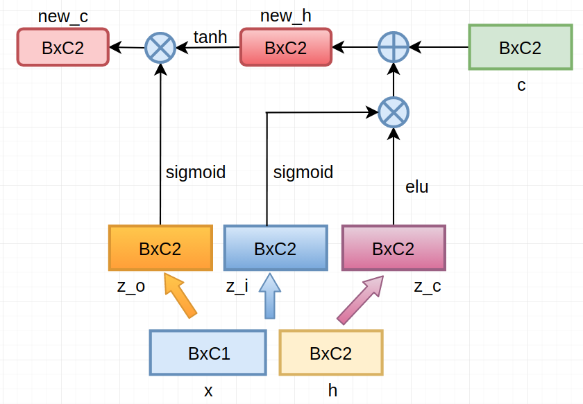

# Custom C++ and CUDA Extensions

> 翻译自：[Custom C++ and CUDA Extensions](https://github.com/goldsborough/tutorials/blob/6e4a693f4ad056ac837b44db839822e29a8be3a1/advanced_source/cpp_extension.rst)

虽然PyTorch中提供了非常多与神经网络相关的操作（例如各类张量运算，数据处理等等），但是你可能还是不满足。因为你可能有一些“新奇”的想法需要实现，而在库中并没有这些函数。此部分就是为了这些目标而存在的。(当然，基于C的扩展也是不错的，可以参考[Extend C](https://github.com/pytorch/extension-ffi) --- 个人的感觉，基于C++的扩展更方便，写起来也更简洁)

最简单实现“新操作”的方法直接通过Python来实现，基于PyTorch的`Function`和`Module`模块来实现。这种实现方式你无须自己写反向传播的式子(即无需写对应的求导式子，库会自动生成)。这种方式虽然很简便，但有时你需要你的代码更高效。例如，你的“新操作”需要被频繁的调用，或者“新操作”需要执行得更快。另一种“貌似更常见”的理由是你的实现依赖于一些C++的库。不管如何，PyTorch提供了能够让你写C++扩展非常方便的方式。

C++扩展是PyTorch开发者提供给使用者通过“非集成到库”的方式来实现自己操作的机制。一方面能够利用PyTorch已经实现的一些操作(注：大部分Python版本的操作你都能够找到对应的PyTorch后端的C++实现，这些你基本都能够调用---主要在`ATen`中)，另一方面你可以高度灵活的实现自己的操作，比如调用STL库等等。

## 实例教程

剩余部分主要通过实例来说明如何来写C++ (和CUDA)扩展。

采用一个“变种的LSTM”来作为这部分的实例，这个变种的LSTM没有“forget gate”以及利用“ELU”作为其中的一个激活函数。显然这种“奇葩”的变种你在库中并不能找到现成的模块，所以你就只能自己来实现咯～不妨让我们先命名这个“变种的LSTM”为LLTM。通过下图来更加形象地说明这个LLTM具体的情况：



（其中：x, h, c为输入，而new_c, new_h为输出，而“粗箭头”表示包含参数的情况；最底下代表x,h进行“合并”成Bx(C1+C2)）

下面分为三部分来讲述这个实例的实现：

1. Python版本：基于`Module`试下
2. C++版本：基于`ATen`里面的一些函数
3. CUDA版本

选择原则：优先考虑Python版本，如果发现各步之间能够融合到一起且对效率有较高的要求可以考虑采用C++和CUDA版本。

## 1. Python版本

正如前面所说的，实现这个新操作最简单的方式是利用`Function`和`Module`模块。废话不多说，直接给出代码如下：

```python
class LLTM(torch.nn.Module):
    def __init__(self, input_features, state_size):
        super(LLTM, self).__init__()
        self.input_features = input_features
        self.state_size = state_size
        # 3 * state_size for input gate, output gate and candidate cell gate.
        # input_features + state_size because we will multiply with [input, h].
        self.weights = torch.nn.Parameter(
            torch.Tensor(3 * state_size, input_features + state_size))
        self.bias = torch.nn.Parameter(torch.Tensor(3 * state_size))
        self.reset_parameters()

    def reset_parameters(self):
        stdv = 1.0 / math.sqrt(self.state_size)
        for weight in self.parameters():
            weight.data.uniform_(-stdv, +stdv)

    def forward(self, input, state):
        old_h, old_cell = state
        X = torch.cat([old_h, input], dim=1)

        # Compute the input, output and candidate cell gates with one MM.
        gate_weights = F.linear(X, self.weights, self.bias)
        # Split the combined gate weight matrix into its components.
        gates = gate_weights.chunk(3, dim=1)

        input_gate = F.sigmoid(gates[0])
        output_gate = F.sigmoid(gates[1])
        # Here we use an ELU instead of the usual tanh.
        candidate_cell = F.elu(gates[2])

        # Compute the new cell state.
        new_cell = old_cell + candidate_cell * input_gate
        # Compute the new hidden state and output.
        new_h = F.tanh(new_cell) * output_gate

        return new_h, new_cell
```

我们可以通过例如下述的方式来调用上述`Module`模块：

```python
import torch

X = torch.randn(batch_size, input_features)
h = torch.randn(batch_size, state_size)
C = torch.randn(batch_size, state_size)

rnn = LLTM(input_features, state_size)

new_h, new_C = rnn(X, (h, C))
```

可以发现Python版本简单到哭，因此如果这种方式能够满足需求就尽量采用这种方式。你可别小看这种实现方式，毕竟这些操作可是PyTorch原生的操作，是经过高度优化的(指的是那些类似`sigmoid`以及张量加法等)，都是基于[NVDIA cuDNN](https://developer.nvidia.com/cudnn)，[Intel MKL](https://software.intel.com/en-us/mkl)或[NNPACK](https://github.com/Maratyszcza/NNPACK)。在大多数情况下，采用上述实现的是足够快的。但是，采用这种方式的实现还是有进一步提升(加速)空间的。最主要的原因是，PyTorch中实现上述过程，只是对每一步每一步进行操作，这就会有一些“瓶颈”，比如每一步均会自己调用CUDA kernel来完成操作，这就会多次调用CUDA kernel来执行，显然如果能把几步合并在一起放到同一个kernel中就会更高效 (这主要是因为GPU中多次调用kernel显然比较慢，要进行数据映射等)。当然还有一些其他原因，就不细究了。

## 2. C++ Extension

C++扩展有两种方式：基于`setuptools`的build “ahead of time”模式；以及基于`torch.utils.cpp_extension.load`库的“just in time”模式（个人的理解(很大可能是错的)：前者可以理解为直接编译好，而后者可以理解为在第一次运行时进行编译：个人更偏向于前者，但整个社区现在在jit方面有很大的投入）。下面首先介绍build `aheand of time`模式，再介绍`just in time`模式

### Building with setuptools

对于“ahead of time”模式，我们通过编写一个使用setuptools库的`setup.py`脚本来编译我们的C++代码。针对上面提出的那个LLTM实例，它对应的`setup.py`文件写成下面形式 (这部分更偏向于setuptools的使用，但PyTorch中你只要记住采用下述模板就差不多了)：

```python
from setuptools import setup
from torch.utils.cpp_extension import CppExtension, BuildExtension

setup(name='lltm',
      ext_modules=[CppExtension('lltm', ['lltm.cpp'])]
      cmdclass={'build_ext': BuildExtension})
```

注：这部分代码中，`CppExtension`是对`setuptools.Extension`进行封装的一个函数，更方便我们使用(其实是帮助小白更方便的使用setuptools)，上述的`CppExtension('lltm', ['lltm.cpp'])`等价于下述操作：

```python
setuptools.Extension(
   name='lltm',
   sources=['lltm.cpp'],
   include_dirs=torch.utils.cpp_extension.include_paths(),
   language='c++')
```

而关于`BuildExtension`，则执行各类需要的参数以及检查混编时的情况。其实说白了，这些你可以暂时别管，照着模板抄一发就好（遇到一些特殊情况，再去翻阅下setuptools的使用教程）

### LLTM的C++操作

来来来，让我们实现LLTM的C++操作吧！由于后续在反向传播时，我们需要对`sigmoid`函数求导，先来看一段短到没朋友的代码 (sigmoid的求导函数---先说这一小段的目的就是，你可以开心地用`at`这个namespace里面的所有函数！)：

```c++
#include <torch/torch.h>

#include <iostream>

at::Tensor d_sigmoid(at::Tensor z) {
  auto s = at::sigmoid(z);
  return (1 - s) * s;
}
```

头文件`<torch/torch.h>`包含一切我们写C++扩展所需。这个头文件包含：

- ATen库，包含主要的张量运算（tensor computation）
- [pybind11](https://github.com/pybind/pybind11)，将C++绑定到Python中
- 关于ATen和pybind11进行交互的头文件

通过上述关于`d_sigmoid`的实现，我们可以看到如何使用ATen库的API (如`at::sigmoid, at::Tensor`)。采用的主要数据类型为`at::Tensor`，关于它完整的API可以参看[Tensor.h](https://github.com/pytorch/pytorch/blob/master/aten/doc/Tensor.h)。顺便提一句，我们可以包含`<iostream>`等C或者C++的头文件（即你可以使用任何C++11的库）

#### 前向传播

完整的前向传播如下所示：

```c++
#include <vector>

std::vector<at::Tensor> lltm_forward(
    at::Tensor input,
    at::Tensor weights,
    at::Tensor bias,
    at::Tensor old_h,
    at::Tensor old_cell) {
  auto X = at::cat({old_h, input}, /*dim=*/1);

  auto gate_weights = at::addmm(bias, X, weights.transpose(0, 1));
  auto gates = gate_weights.chunk(3, /*dim=*/1);

  auto input_gate = at::sigmoid(gates[0]);
  auto output_gate = at::sigmoid(gates[1]);
  auto candidate_cell = at::elu(gates[2], /*alpha=*/1.0);

  auto new_cell = old_cell + candidate_cell * input_gate;
  auto new_h = at::tanh(new_cell) * output_gate;

  return {new_h,
          new_cell,
          input_gate,
          output_gate,
          candidate_cell,
          X,
          gate_weights};
}
```

（注：能够利用`at`中已经实现的函数，尤其是调用CuDnn以及MKL等库相关的操作）

#### 反向传播

到目前为止，PyTorch的C++交互还不支持自动求导机制，这是PyTorch团队正在进行的一部分工作(如果支持了，开心飞了～)。因此，我们还需要实现LLTM的反向传播 (其实没那么难理解，你照着前面的图，箭头全都翻过来，硬算一发就好了)：

```c++
// tanh'(z) = 1 - tanh^2(z)
at::Tensor d_tanh(at::Tensor z) {
  return 1 - z.tanh().pow(2);
}

// elu'(z) = relu'(z) + { alpha * exp(z) if (alpha * (exp(z) - 1)) < 0, else 0}
at::Tensor d_elu(at::Tensor z, at::Scalar alpha = 1.0) {
  auto e = z.exp();
  auto mask = (alpha * (e - 1)) < 0;
  return (z > 0).type_as(z) + mask.type_as(z) * (alpha * e);
}

std::vector<at::Tensor> lltm_backward(
    at::Tensor grad_h,
    at::Tensor grad_cell,
    at::Tensor new_cell,
    at::Tensor input_gate,
    at::Tensor output_gate,
    at::Tensor candidate_cell,
    at::Tensor X,
    at::Tensor gate_weights,
    at::Tensor weights) {
  auto d_output_gate = at::tanh(new_cell) * grad_h;
  auto d_tanh_new_cell = output_gate * grad_h;
  auto d_new_cell = d_tanh(new_cell) * d_tanh_new_cell + grad_cell;

  auto d_old_cell = d_new_cell;
  auto d_candidate_cell = input_gate * d_new_cell;
  auto d_input_gate = candidate_cell * d_new_cell;

  auto gates = gate_weights.chunk(3, /*dim=*/1);
  d_input_gate *= d_sigmoid(gates[0]);
  d_output_gate *= d_sigmoid(gates[1]);
  d_candidate_cell *= d_elu(gates[2]);

  auto d_gates =
      at::cat({d_input_gate, d_output_gate, d_candidate_cell}, /*dim=*/1);

  auto d_weights = d_gates.t().mm(X);
  auto d_bias = d_gates.sum(/*dim=*/0, /*keepdim=*/true);

  auto d_X = d_gates.mm(weights);
  const auto state_size = grad_h.size(1);
  auto d_old_h = d_X.slice(/*dim=*/1, 0, state_size);
  auto d_input = d_X.slice(/*dim=*/1, state_size);

  return {d_old_h, d_input, d_weights, d_bias, d_old_cell};
}
```

#### 绑定到Python

一旦你通过C++和ATen写完了你的操作，你可以利用pybind11将你的C++函数或者类绑定到Python中。这部分主要的原理之类的，可以参考[pybind11文档](http://pybind11.readthedocs.io/en/master/)

对于LLTM这个例子，仅仅四行代码就能搞定(加到lltm.cpp文件末尾就好)

```c++
PYBIND11_MODULE(TORCH_EXTENSION_NAME, m) {
  m.def("forward", &lltm_forward, "LLTM forward");
  m.def("backward", &lltm_backward, "LLTM backward");
}
```

注：`TORCH_EXTENSION_NAME`这个宏会在你利用`setup.py`脚本时，自动赋为你设定的名字(如前面我们采用`lltm`这个名字)

### 使用你的扩展

现在将我们的扩展导入到PyTorch中去。先来看下目前的目录结构如下所示：

```
pytorch/
  lltm-extension/
    lltm.cpp
    setup.py
```

运行`python setup.py install`来编译和安装自己写的扩展，将会出现下面这段“编译和安装”说明：

```
running install
running bdist_egg
running egg_info
writing lltm.egg-info/PKG-INFO
writing dependency_links to lltm.egg-info/dependency_links.txt
writing top-level names to lltm.egg-info/top_level.txt
reading manifest file 'lltm.egg-info/SOURCES.txt'
writing manifest file 'lltm.egg-info/SOURCES.txt'
installing library code to build/bdist.linux-x86_64/egg
running install_lib
running build_ext
building 'lltm' extension
gcc -Wsign-compare -DNDEBUG -g -fwrapv -O3 -Wall -Wstrict-prototypes -fPIC -I~/local/miniconda/lib/python3.6/site-packages/torch/lib/include -I~/local/miniconda/lib/python3.6/site-packages/torch/lib/include/TH -I~/local/miniconda/lib/python3.6/site-packages/torch/lib/include/THC -I~/local/miniconda/include/python3.6m -c lltm.cpp -o build/temp.linux-x86_64-3.6/lltm.o -DTORCH_EXTENSION_NAME=lltm -std=c++11
cc1plus: warning: command line option ‘-Wstrict-prototypes’ is valid for C/ObjC but not for C++
g++ -pthread -shared -B ~/local/miniconda/compiler_compat -L~/local/miniconda/lib -Wl,-rpath=~/local/miniconda/lib -Wl,--no-as-needed -Wl,--sysroot=/ build/temp.linux-x86_64-3.6/lltm.o -o build/lib.linux-x86_64-3.6/lltm.cpython-36m-x86_64-linux-gnu.so
creating build/bdist.linux-x86_64/egg
copying build/lib.linux-x86_64-3.6/lltm_cuda.cpython-36m-x86_64-linux-gnu.so -> build/bdist.linux-x86_64/egg
copying build/lib.linux-x86_64-3.6/lltm.cpython-36m-x86_64-linux-gnu.so -> build/bdist.linux-x86_64/egg
creating stub loader for lltm.cpython-36m-x86_64-linux-gnu.so
byte-compiling build/bdist.linux-x86_64/egg/lltm.py to lltm.cpython-36.pyc
creating build/bdist.linux-x86_64/egg/EGG-INFO
copying lltm.egg-info/PKG-INFO -> build/bdist.linux-x86_64/egg/EGG-INFO
copying lltm.egg-info/SOURCES.txt -> build/bdist.linux-x86_64/egg/EGG-INFO
copying lltm.egg-info/dependency_links.txt -> build/bdist.linux-x86_64/egg/EGG-INFO
copying lltm.egg-info/top_level.txt -> build/bdist.linux-x86_64/egg/EGG-INFO
writing build/bdist.linux-x86_64/egg/EGG-INFO/native_libs.txt
zip_safe flag not set; analyzing archive contents...
__pycache__.lltm.cpython-36: module references __file__
creating 'dist/lltm-0.0.0-py3.6-linux-x86_64.egg' and adding 'build/bdist.linux-x86_64/egg' to it
removing 'build/bdist.linux-x86_64/egg' (and everything under it)
Processing lltm-0.0.0-py3.6-linux-x86_64.egg
removing '~/local/miniconda/lib/python3.6/site-packages/lltm-0.0.0-py3.6-linux-x86_64.egg' (and everything under it)
creating ~/local/miniconda/lib/python3.6/site-packages/lltm-0.0.0-py3.6-linux-x86_64.egg
Extracting lltm-0.0.0-py3.6-linux-x86_64.egg to ~/local/miniconda/lib/python3.6/site-packages
lltm 0.0.0 is already the active version in easy-install.pth

Installed ~/local/miniconda/lib/python3.6/site-packages/lltm-0.0.0-py3.6-linux-x86_64.egg
Processing dependencies for lltm==0.0.0
Finished processing dependencies for lltm==0.0.0
```

（注：其实你会发现就是将这个模块制作成`lltm-0.0.0-py3.6-linux-x86_64.egg`放到site-packages中）

