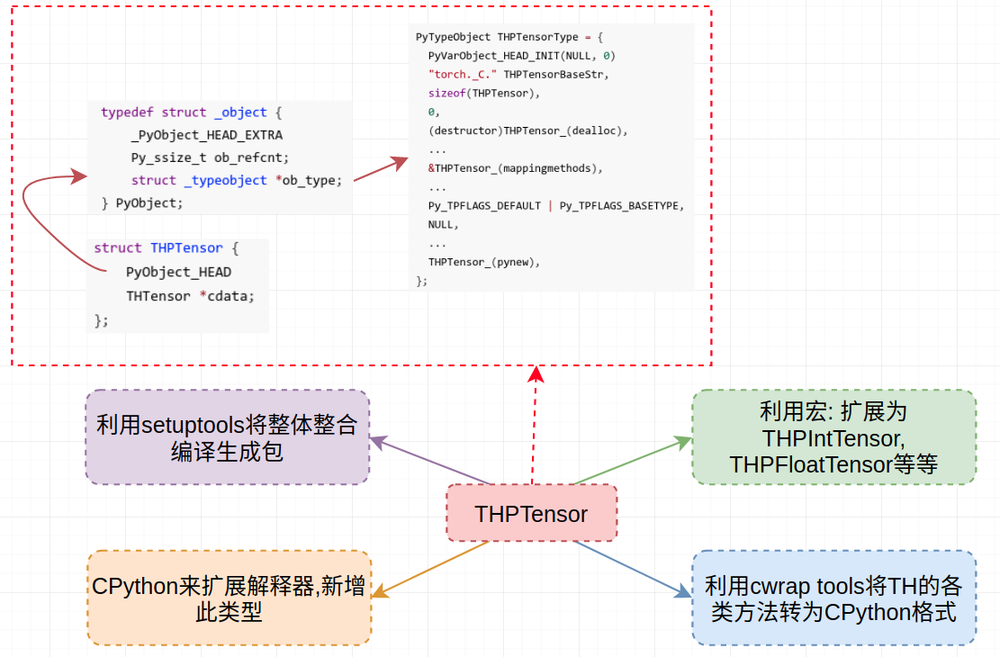

# torch._C Package (2)

> 这个系列翻译自：[A Tour of PyTorch Internals (Part I)](http://pytorch.org/2017/05/11/Internals.html)

让我们接着上半部分来介绍

目录：

Part I：扩展Python解释器

- torch._C新模块
- THPTensor类型

Part II：通用解析

- 通用编译 (Part 1)
- 通用编译 (Part 2)

Part III：模块对象和类型方法

- 新类型中添加方法(1)
- 新类型中添加方法 (2)

Part IV: 总结

## Part II: “通用解析“

在Part I中虽然建立了扩展模块`torch._C`，但是其中加入的各种不同的数据类型(如THPIntTensor等)是如何通过通用的数据类型`THPTensor`”变出来“的，以及该通用数据类型是如何和底层的`TH`库关联起来的，则是这一部分和下一部分的内容。

### ① 通用编译 (Part 1)

关于`THPTensor`这个通用类型还有非常多的内容没有细讲以及如何将其与新定义的python对象关联起来也还未讲。但先让我们来看看如何将通用的`THPTensor_(init)()`函数转化为“真正用到”的形式`THPIntTensor_init()`。以及如何将我们定义的“通用”的Tensor（在`csrc/generic/Tensor.cpp`中）置换产生各种类型的python对象。

首先，让我们来看下`Tensor.cpp`中的一个函数：

```c
PyObject * THPTensor_(NewEmpty)()
{
  return THPTensor_(New)(THTensor_(new)(LIBRARY_STATE_NOARGS));
}
```

这个返回类型采用[csrc/Tensor.h](https://github.com/pytorch/pytorch/blob/master/torch/csrc/Tensor.h)中的宏和[aten/src/TH/THTensor.h](https://github.com/pytorch/pytorch/blob/master/aten/src/TH/THTensor.h)中的宏：

- 调用`THP<Type>Tensor_New(...)`来替换`THPTensor_(New)`
- 调用`TH<Type>Tensor_new(...)`来替换`THTensor_(new)`

换言之，为了支持各种类型的tensor，我们需要“产生”类似上述替换后的代码。而这一步操作是在PyTorch的“编译”阶段完成的。PyTorch运用[setuptools](https://setuptools.readthedocs.io/en/latest/)工具来“编译”各种包。我们可以看到一个`setup.py`文件在顶层目录(即`pytorch`目录下)，用来“编译”。

利用`setuptools`编译扩展模块时有一步是“列出”所有需要编译的文件。但是我们发现`csrc/generic/Tensor.cpp`并不在该列表中！因此，这部分代码又是如何转化到最终的包中的呢？

如果再看下`csrc`文件夹，我们会发现此处还有一个名为`Tensor.cpp`文件，而该文件的最后一条语句为(这条语句非常重要！)：

```c
//generic_include TH torch/csrc/generic/Tensor.cpp
```

注意到该文件`csrc/Tensor.cpp`在列表中：`main_sources += split_types("torch/csrc/Tensor.cpp", ninja_global)`，通过调用辅助函数`split_types` (在`tools/setup_helpers/split_types.py`中)来完成目的。这个函数通过寻找输入文件中是否含有`//generic_include`字符串，如果找到，则产生一系列新的输出文件(每个对应新的tensor类型)，主要包含下述变化：

1. 输出文件被重命名为`Tensor<Type>.cpp`

2. 输出文件里面的内容被稍微修改了下，如下所示

   ```c
   // Before:
   //generic_include TH torch/csrc/generic/Tensor.cpp

   // After:
   #define TH_GENERIC_FILE "torch/src/generic/Tensor.cpp"
   #include "TH/THGenerate<Type>Type.h"
   ```

> 说明：可以通过在pytorch文件下建一个`xxx.py`文件，其内容为
>
> ```c
> from tools.setup_helpers.split_types import split_types
>
> ninja_global = None
> main_sources = []
> main_sources += split_types("torch/csrc/Tensor.cpp", ninja_global)
> ```
>
> 运行上述，会看到在`csrc`中产生`generated`文件夹：里面包含各种“具体”的tensor类型。而这些产生的文件会加到编译列表中。

下面来看看产生的`TensorFloat.cpp`的内容：

```c
#define __STDC_FORMAT_MACROS

#include <Python.h>
#include <structmember.h>

#define THP_HOST_HALF

#include <stdbool.h>
#include <vector>
#include <stack>
#include <tuple>
#include <TH/THMath.h>

#include "torch/csrc/THP.h"
#include "torch/csrc/copy_utils.h"
#include "torch/csrc/DynamicTypes.h"
#include "torch/csrc/utils/tensor_numpy.h"

#define TH_GENERIC_FILE "torch/csrc/generic/Tensor.cpp"
#include "TH/THGenerateFloatType.h"   // 这部分调用底层的TH中的"具体类型"---其中包含各种宏的具体指代
```

下面再稍微了解下`#include "TH/THGenerateFloatType.h" `中的内容：

```c
#ifndef TH_GENERIC_FILE
#error "You must define TH_GENERIC_FILE before including THGenerateFloatType.h"
#endif

#define real float
#define accreal double
#define TH_CONVERT_REAL_TO_ACCREAL(_val) (accreal)(_val)
#define TH_CONVERT_ACCREAL_TO_REAL(_val) (real)(_val)
#define Real Float
#define THInf FLT_MAX
#define TH_REAL_IS_FLOAT
#line 1 TH_GENERIC_FILE
#include TH_GENERIC_FILE
#undef accreal
#undef real
#undef Real
#undef THInf
#undef TH_REAL_IS_FLOAT
#undef TH_CONVERT_REAL_TO_ACCREAL
#undef TH_CONVERT_ACCREAL_TO_REAL

#ifndef THGenerateManyTypes
#undef TH_GENERIC_FILE
#endif
```

这个文件的主要目的是将`Tensor.cpp`里面的内容“具体化”，即用宏对应的具体内容替换掉。例如，我们定义`real`为`float`，在预处理阶段会将`real`全部替换为`float`。

几点说明：① `split_types`函数并不是严格必要的，我们可以封装`Tensor.cpp`到某个文件，然后重复多个不同类型，采用`split_types`函数主要是为了加快编译。② 此处所说的“类型替换”(如用float替换real)均是在C的预处理器中完成的

### ② 通用编译 (Part 2)

到目前为止，我们已经有了各种Tensor类型的源文件(可以理解为通用编译 Part 1的结果)，我们需要进一步考虑如何创建具有对应声明的头文件，以及我们是如何将`THTensor_(method)`和`THPTensor_(method)`转化为`TH<Type>Tensor_method`和`THP<Type>Tensor_method`。例如在`csrc/generic/Tensor.h`中有类似下述语句的声明：

```c
THP_API PyObject * THPTensor_(New)(THTensor *ptr);
```

我们在头文件中采用和源文件转化相同的策略，在`csrc/Tensor.h`中，包含下述语句

```c
#include "generic/Tensor.h"
#include <TH/THGenerateAllTypes.h>

#include "generic/Tensor.h"
#include <TH/THGenerateHalfType.h>
```

这与源文件中(如生成的`TensorFloat.cpp`)的类似语句具有相同的效果：用“宏定义”来“解析”出不同的数据类型的头文件声明语句。唯一一点不同只是我们用一个头文件将包含各种不同数据类型的声明语句，而不是像源文件一样生成多个`.cpp`文件。

最后，我们需要考虑如何“解析”函数类型的，其实不难发现同一个头文件中，具有下述宏定义：

```
#define THPTensor_(NAME)            TH_CONCAT_4(THP,Real,Tensor_,NAME)
```

这个宏告诉我们任何源文件中格式为`THPTensor_(NAME)`的函数名字会被替换为`THPRealTensor_NAME`，而其中的`Real`又恰好也通过`#define`定义为具体的数据类型了（对应`.cpp`文件调用的`TH/THxxxType.h`中定义的宏）。正如上述所见，我们的头文件和源文件里面涉及到很多和“宏”相关的内容，而在预处理器阶段，这些宏均会被替换成我们所需要的形式。在底层的`TH`库中也是通过`THTensor_(NAME)`的宏来“解析”为不同的数据类型。到此为止，我们已经了解了通用类型的源码是如何被“变为”特定类型的源码。

> 说明：上述内容蕴含着如何将底层的`TH`中的Tensor定义到`THP`中。

## Part III: 模块对象和类型方法

到目前为止，我们已经看到了如何将底层的`TH`中的Tensor定义到`THP`中，并产生类似`THPFloatTensor_init(...)`等方法。下面让我们来探索上述代码如何在我们最终的module里面发挥作用。关键在`THPTensor_(init)`中的下述一行：

```c
// 将基于THPTensorType"类型对象"产生的PyObject加入到module中(module也是PyObject对象)
PyModule_AddObject(module, THPTensorBaseStr, (PyObject *)&THPTensorType);
```

这个函数将我们的tensor对象添加到扩展模块module中，从而我们可以在python层面使用类似`THPFloatTensor`和`THPIntTensor`等等类型。

仅仅创建tensor对象并不是很有用，我们还需要进一步调用那些在底层`TH`中实现的各类方法。例如底层`TH`中实现的`zeros_`方法，希望在python层面对应：

```python
x = torch.FloatTensor(10)
x.zero_()
```

### ① 新类型中添加方法 (1)

首先让我们来看下如何向新定义的类型中添加方法。在”类型对象“里面对应的是`tp_methods`区域。这个区域包含各种方法定义(`PyMethodDef`s)的数组以及其关联的方法(它们对应的底层c/c++代码)。假设我们希望定义一个新方法`replaces values`到我们的`PyFloatObject`对象中去，可以采用下述实现：

① 可以看成底层的C/C++实现 (由于cpython的要求)：关于这部分内容，建议看关于CPython的内容

```c
static PyObject * replace(PyFloatObject *self, PyObject *args) {
	double val;
	if (!PyArg_ParseTuple(args, "d", &val))
		return NULL;
	self->ob_fval = val;
	Py_RETURN_NONE
}
```

② 上述对应的python实现（此处只是为了说明）

```python
def replace(self, val):
	self.ob_fval = fal
```

③ 将①放到`PyMethodDef`数组float_methods中

```c
static PyMethodDef float_methods[] = {
	{"replace", (PyCFunction)replace, METH_VARARGS,
	"replace the value in the float"
	},
	{NULL} /* Sentinel */
}
```

上述过程注册了一个名叫`replace`的方法，其具体实现是同名的C层面的实现。之后再将此数组`float_method`放入到”类型对象“的`tp_methods`区域即可。

当然，我们希望能够在`THP`中的Tensor等价的使用`TH`中Tensor的方法。但是写一系列上述类似的封装(即①中的函数和③)显然是费时费力还容易出错的，我们希望采用更好的方式来实现。

### ② 新类型中添加方法 (2) 

PyTorch通过自己的“cwrap工具”来封装底层的`TH`方法，从而能够被用到Python的后端(其实可以理解为通过标准C函数自动生成对应的CPython函数)。主要的方式为：① 先建立几个`.cwrap`文件，其中的内容为YAML格式定义的一系列C方法的声明（这些文件在`csrc/generic/methods`中）， ② 通过“cwrap工具”将这些文件转换为`.cpp`文件，而这些`.cpp`文件包含的内容则是和`THPTensor`对象以及Python C扩展形式 (类似上一个章节中的①的形式)兼容。而这个“cwrap工具”不仅仅能够处理底层的`TH`，还能够处理`CuDNN`。

> 说明：这些“cwrap工具”在`tools/cwrap`中，但在`setup.py`文件中则是通过`tools/setup_helpers/generate_code.py`文件间接调用此“cwrap工具”的

下述给出一个YAML格式的声明形式（`addmv_`函数---在`TensorMath.cwrap`中）：

```
[[
  name: addmv_
  cname: addmv
  return: self
  arguments:
    - THTensor* self
    - arg: real beta
      default: AS_REAL(1)
    - THTensor* self
    - arg: real alpha
      default: AS_REAL(1)
    - THTensor* mat
    - THTensor* vec
]]
```

“cwrap工具”的结构非常简单，读取一个文件，然后通过一系列“插件”来处理该文件。关于具体有哪些插件以及各插件的功能详见`tools/cwrap/plugins/__init__.py`文件。

关于源码(此处指的是此工具生成的`.cpp`文件)的产生经过几个阶段：首先，YAML形式的“声明”被解析和处理，然后源码被一条一条地生成：例如添加参数检查，定义等等以及调用底层的`TH`里面对应的方法。最后，“cwrap工具”处理整个文件。关于`addmv_`被处理后产生的结果可见：[addmv_.cpp](https://gist.github.com/killeent/c00de46c2a896335a52552604cc4d74b)

> 补充，如果你想自己来尝试下这个过程，可以新建一个`test.cwrap`，然后从`TensorMath.cwrap`复制一段过来。然后通过下述代码来生成对应的`.cpp`文件（下述代码从`generate_code.py`中提取出来）
>
> ```python
> from tools.cwrap import cwrap
> from tools.cwrap.plugins.THPPlugin import THPPlugin
> from tools.cwrap.plugins.ArgcountSortPlugin import ArgcountSortPlugin
> from tools.cwrap.plugins.AutoGPU import AutoGPU
> from tools.cwrap.plugins.BoolOption import BoolOption
> from tools.cwrap.plugins.KwargsPlugin import KwargsPlugin
> from tools.cwrap.plugins.WrapDim import WrapDim
> from tools.cwrap.plugins.AssertNDim import AssertNDim
>
> from tools.cwrap.plugins.Broadcast import Broadcast
> from tools.cwrap.plugins.ProcessorSpecificPlugin import ProcessorSpecificPlugin
> import os
> import sys
>
> root = os.path.dirname(os.path.dirname(os.path.dirname(os.path.abspath(__file__))))
> sys.path.insert(0, root)
> thp_plugin = THPPlugin()
>
> cwrap(os.path.join(root, 'torch/csrc/generic/test.cwrap'), plugins=[
>     ProcessorSpecificPlugin(), BoolOption(), thp_plugin,
>     AutoGPU(condition='IS_CUDA'), ArgcountSortPlugin(), KwargsPlugin(),
>     AssertNDim(), WrapDim(), Broadcast()
> ])
> ```

为了和CPython的后端关联起来，通过上述工具产生一个元素为`PyMethondDef`的数组，然后该数组能够被添加到`THPTensor`的`tp_methods`区域

> 说明：在`THPTensor`中，主要通过`THPTensor_(init)`函数中的`THPTensor_(initCopyMethods)();`来将这些方法添加到`tp_methods`区域 --- 而`THPTensor_(initCopyMethods)`和`csrc/copy_utils.h`又有紧密的联系

## Part IV: 总结

到目前为止，我们了解了 ①如何创建一个新的扩展模块来扩展Python解释器 ② 该扩展模块如何定义我们新的`THPTensor`类型 ③ 如何生成各种Tensor类型以及和底层的`TH`模块关联起来

`setuptools`允许我们为编译定义扩展部分。整个`torch._C`扩展模块通过“集结”各源文件，头文件，库等等来创建一个`setuptools`的扩展来进行编译。然后`setuptools`为我们编译这个扩展文件。关于更多build过程将在第二个系列里面介绍。

来回顾一下文章开头所提出的4个问题：

> PyTorch是如何扩展Python的解释器：定义了能够被Python直接操作的Tensor类型

利用CPython的框架来扩展Python解释器和定义新类型的，并采用“特殊的方式”(可以暂时理解为“宏的方式”)产生各种不同的数据类型

> PyTorch是如何封装那些实际定义了Tensor的属性和方法的C库（可以理解为如何封装底层`TH`）

通过定义了一个新的数据类型`THPTensor`，其后端就是`TH`的Tensor。调用函数其实先通过CPython形式的`THPTensor`来调用TH中的`Tensor`

> PyTorch是如何封装与Tensor相关的那些方法的

利用YAML形式的文件并借助“cwrap工具”来自动生成对应的CPython格式的"封装源码"

> PyTorch是如何将各个组件合起来构成成一个可运行的包

通过`setuptools`库将各种头文件，源文件，库合起来编译（这部分在下一个系列中介绍）

下面用一幅图来总结上述的内容：

